# Topic 10 — Viruses, Bacteria and Archaea

*ASB0204 Biology I, Dr. Nur Akmal binti Ishak & Dr. Ezyana binti Kamal Bahrin, Biology Unit, ASPutra*

**The Invisible Us — the human microbiome.** The **microbiome** is the community of microorganisms (fungi, bacteria, viruses) that exists in a particular environment. The American Academy of Microbiology estimates each human "ecosystem" contains around **100 trillion microorganism cells** against just **37 trillion human cells** — a reminder of just how much of "us" is actually microbial.

## 10.1 Viruses

### 10.1a The structure of a virus

- A virus is very small (~20–300 nm).
- Viruses are characterised by: **size and shape** (helical, polyhedral, complex), **presence/absence of an outer envelope**, and **type of nucleic acid** (DNA or RNA).

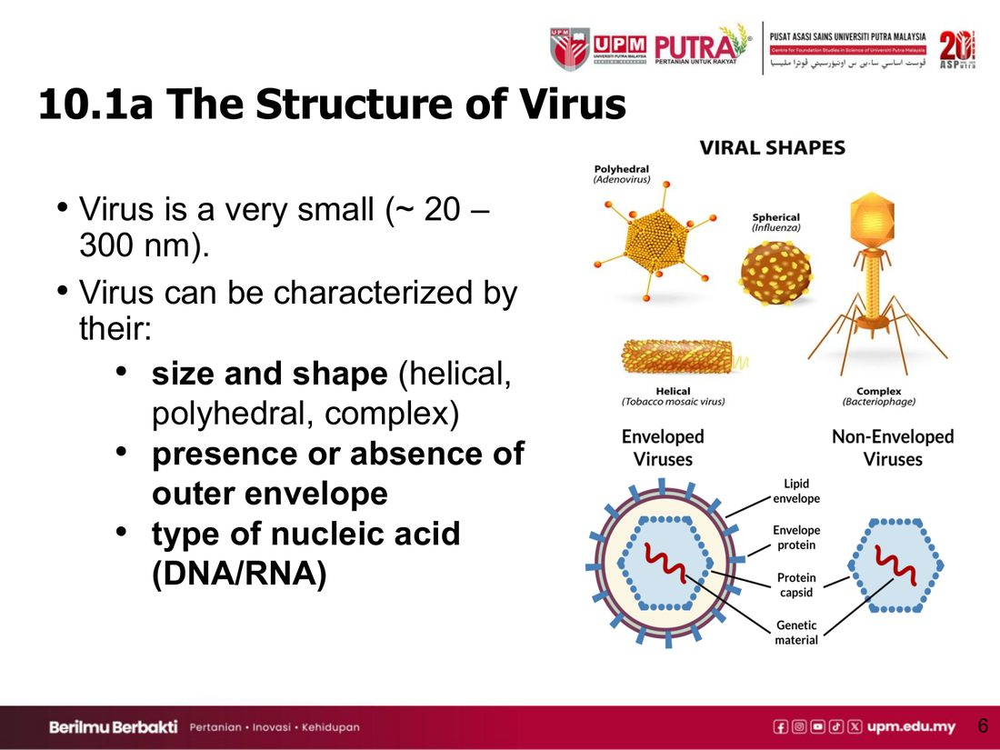

Every virus particle has at least two parts:

- **Covering** — the **capsid** (protein coat, made of subunits called capsomers), plus an **envelope** in some viruses (a membranous layer surrounding the capsid — not present in all viruses).
- **Inner core** — the **nucleic acid** (DNA or RNA), plus various proteins (e.g. enzymes).

A **naked virus** has no envelope around the capsid; an **enveloped virus** has an extra lipid envelope surrounding the capsid.

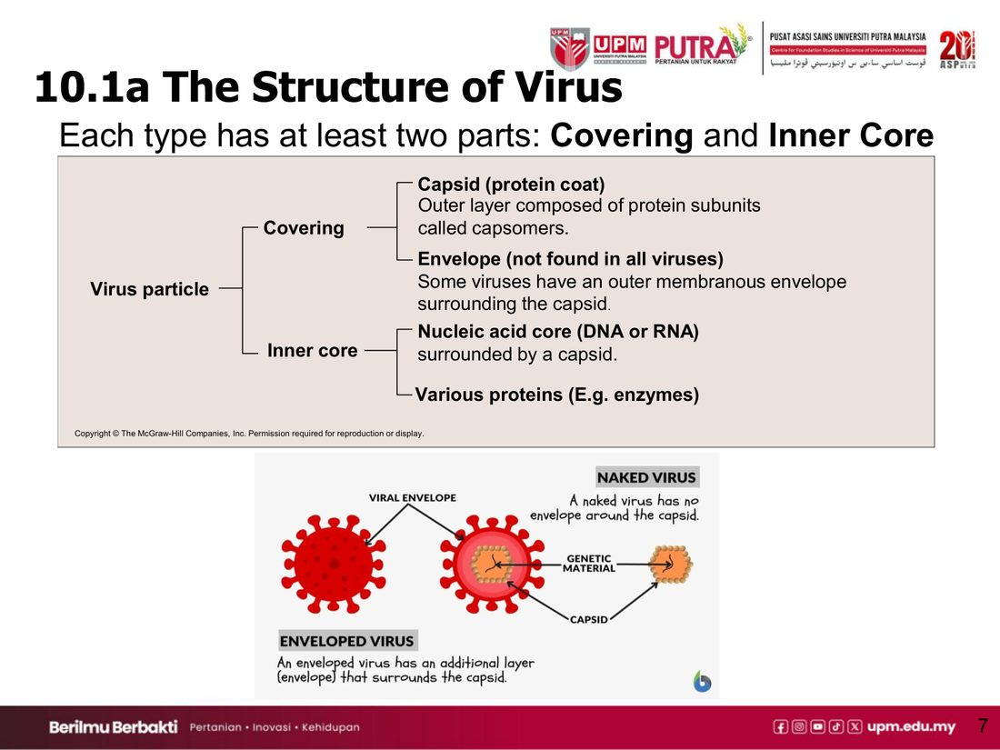

**Examples of DNA viruses:** Adenovirus (polyhedral capsid with a fiber protein at each corner) and the T-even bacteriophage (polyhedral head + helical tail, DNA genome).

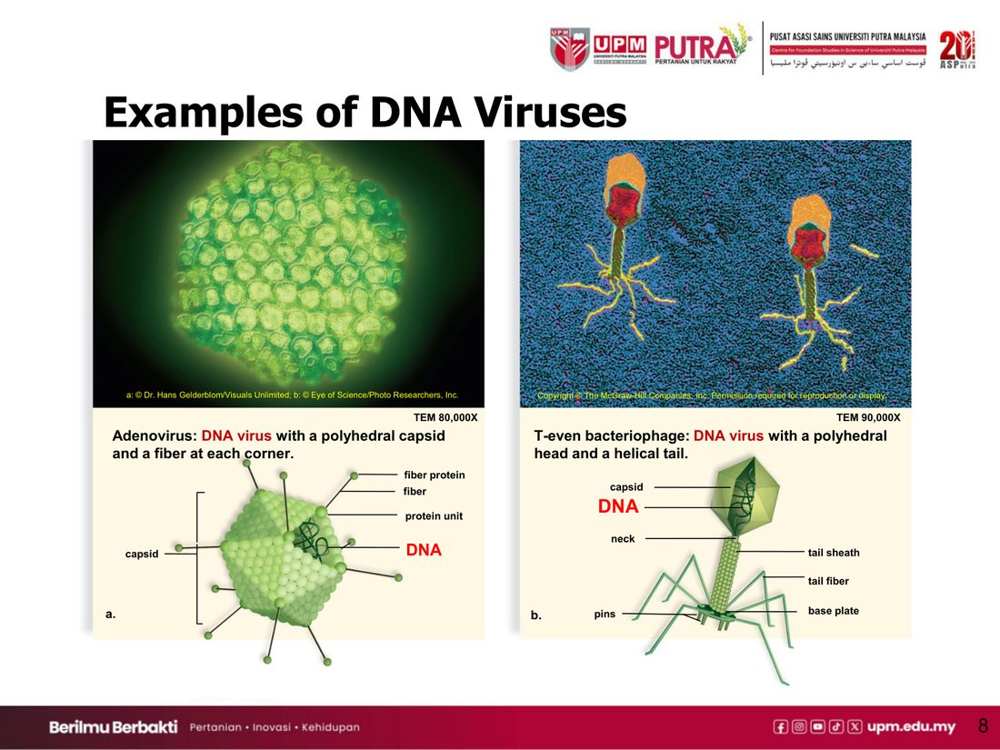

**Examples of RNA viruses:** Tobacco mosaic virus (helical capsid) and influenza virus (spherical capsid surrounded by an envelope with spikes).

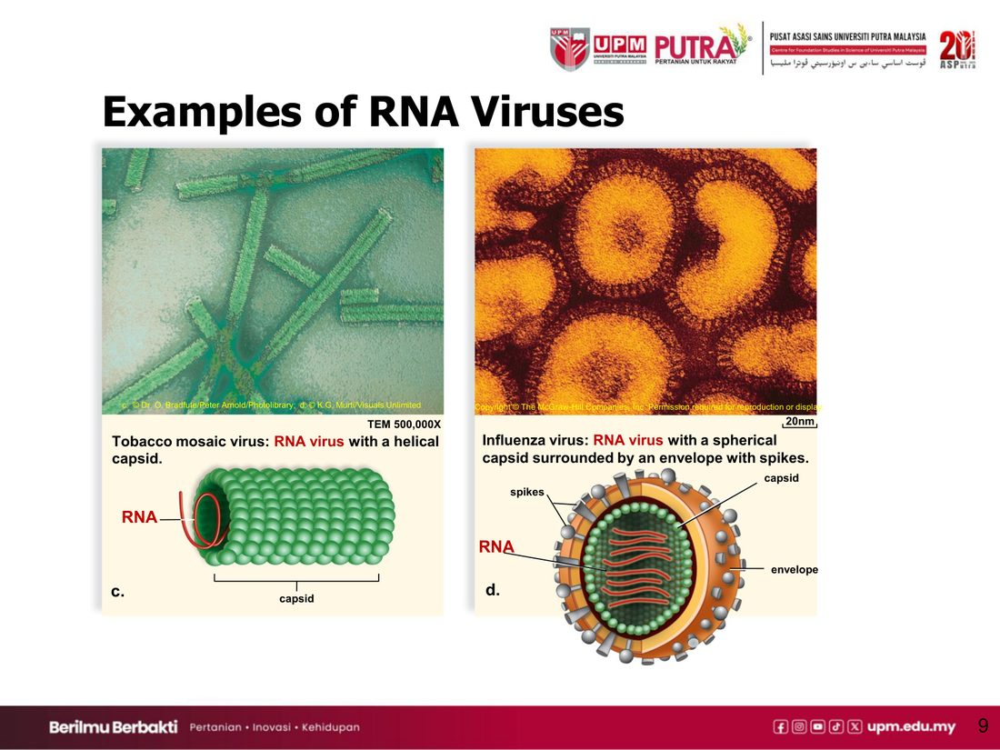

### 10.1b Characteristics of viruses

**1. Parasitic nature.** Viruses are **obligate intracellular parasites**: they can reproduce only within host cells, using the host's resources, because they cannot replicate their own genetic material alone. Once inside a host cell, they hijack its protein-synthesis machinery to replicate nucleic acids, capsids and viral enzymes.

**2. Host specificity.** Viruses only infect specific types of organisms (bacteria, plants, fungi, animals, etc.). This specificity is determined by the interaction between **viral surface proteins** (e.g. spike protein, glycoprotein, capsid) and the **receptor** on the surface of the host cell's membrane — like a lock and key.

| Virus | Host specific to |
|---|---|
| Tobacco mosaic virus | Tobacco plant |
| Rabies | Mammals |
| HIV | White blood cells |
| Hepatitis | Liver cells |

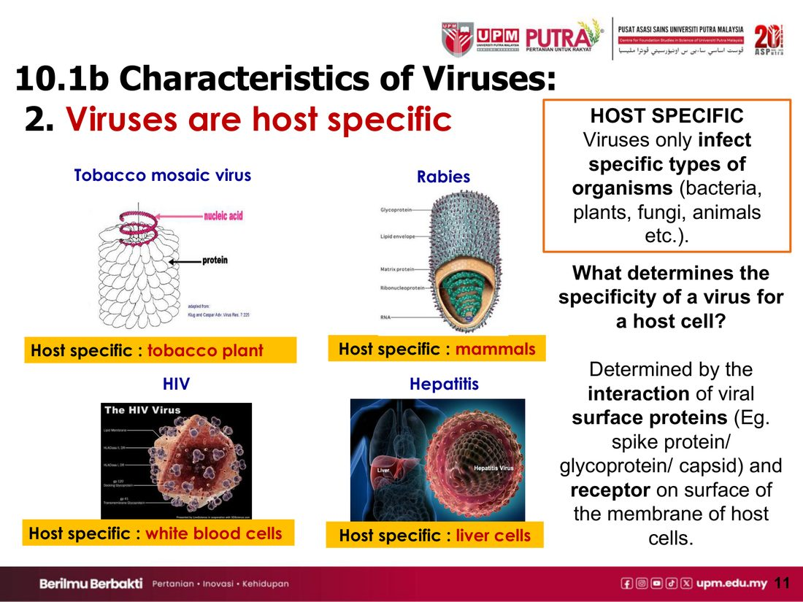

### 10.1c Lytic and lysogenic cycles of bacteriophage

**Bacteriophages** are viruses that infect bacteria.

**Lytic cycle** (5 steps):

1. **Attachment** — phage attaches to a specific receptor on the bacterial cell surface.
2. **Penetration** — viral DNA enters the host cell (injected into the cytoplasm).
3. **Biosynthesis** — viral components are synthesised using the host cell's machinery and energy.
4. **Maturation** — viral components are assembled into new viruses.
5. **Release** — new viruses exit the host cell, through lysis (bursting) or budding, to infect new host cells.

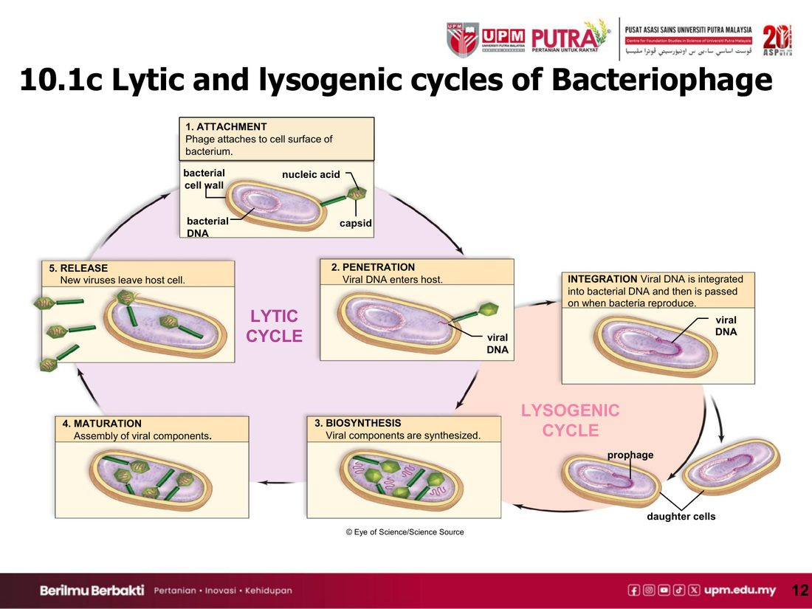

**Lysogenic cycle:** After the phage DNA is inserted, it can instead **integrate into the host cell's DNA** with no destruction of the host DNA. The integrated, dormant viral DNA is called a **prophage**; the phage is said to be **latent**. The prophage is replicated along with the host's DNA every time the bacterium divides, so all descendant ("lysogenic") cells carry a copy of the prophage genome — viral reproduction doesn't happen immediately, but may occur later. Certain environmental factors (UV radiation, nutrient scarcity, chemical treatment, etc.) can induce the prophage to **re-enter the lytic cycle**, resuming the lytic steps above and ultimately bursting the cell.

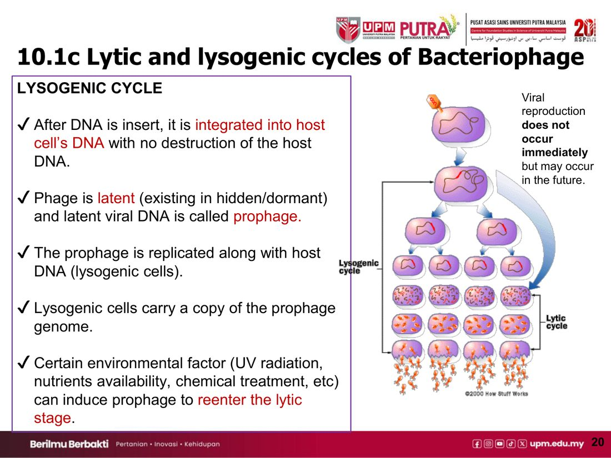

### 10.1d Retrovirus

A **retrovirus** is a type of virus that specifically contains **RNA** (instead of DNA) as its genetic material, and uses **reverse transcription** to convert that RNA into DNA. Example: **HIV**, the virus that causes AIDS.

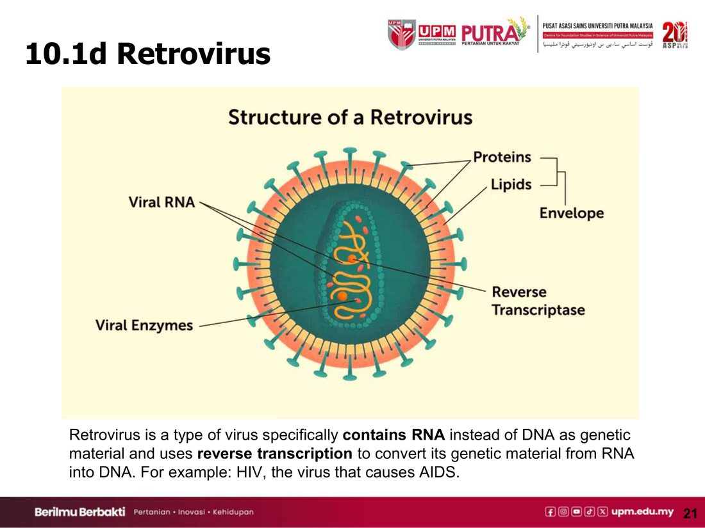

**Reproductive cycle of a retrovirus** (6 steps):

1. **Attachment** — the animal virus attaches to a host-cell receptor; enveloped viruses fuse with the cell's plasma membrane.
2. **Entry** — capsid and nucleic acid are released into the host cell's cytoplasm; the capsid is removed by enzymes, uncoating and releasing the viral RNA.
3. **Reverse transcription** — the enzyme **reverse transcriptase** converts the viral RNA into complementary DNA (cDNA), which becomes double-stranded and is then **integrated** into the host's DNA (via the enzyme integrase) as a **provirus**. The provirus is replicated whenever the host DNA replicates, and the retrovirus can remain latent in the host genome for years. (The "retro" in retrovirus refers to this reverse — RNA to DNA — process.)
4. **Biosynthesis** — the provirus is transcribed into viral mRNA and translated to make the proteins/enzymes needed for new retrovirus components.
5. **Maturation** — retrovirus components (capsid, viral RNA, viral enzymes) are assembled into new retroviruses.
6. **Release** — new retroviruses **bud** off the cell, using the host's plasma membrane to form their new viral envelope.

*Note: steps 1–2 and 4–6 mirror the bacteriophage cycle, but a retrovirus like HIV is released by budding rather than by lysis.*

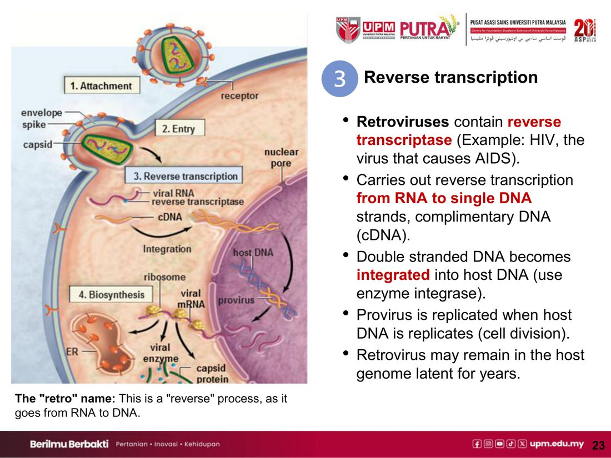

*(Real-world context: Malaysia's own HIV transmission profile has shifted dramatically — from 61% injecting-drug-use-driven cases in 1990, to just 3% by 2023, with homosexual/bisexual transmission now accounting for 62% of cases. Source: HIV/STI Section, Division of Disease Control, Ministry of Health Malaysia.)*

## 10.2 The Prokaryotes (Bacteria and Archaea)

### 10.2a The structure of prokaryotes

- Length ranges from **1 to 5 µm**.
- Most prokaryotes are **unicellular**.
- They **lack a membrane-bound nucleus and organelles** — though they do contain ribosomes and storage granules.
- Most prokaryotes have a **cell wall** to support and maintain their shape, made of **peptidoglycan** — though peptidoglycan is **absent in Archaea**.

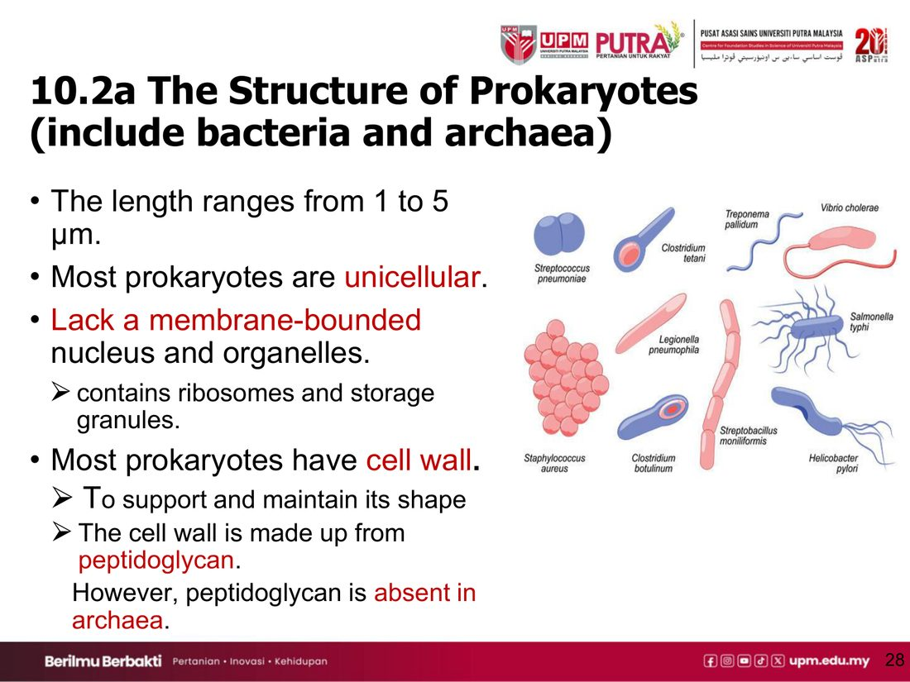

Many species also produce a **capsule/slime layer** around the cell wall (made of polysaccharide or protein) that protects against phagocytosis and helps the cell attach to surfaces (rocks, plant roots, human teeth) — e.g. *Streptococcus pneumoniae*. **Fimbriae and pili** also help cells attach to surfaces and transmit DNA between cells.

A prokaryotic cell is organised into three parts: **cell envelope** (glycocalyx, cell wall, plasma membrane), **cytoplasm** (nucleoid, ribosomes, and thylakoids in cyanobacteria), and **appendages** (flagella, conjugation pilus, fimbriae).

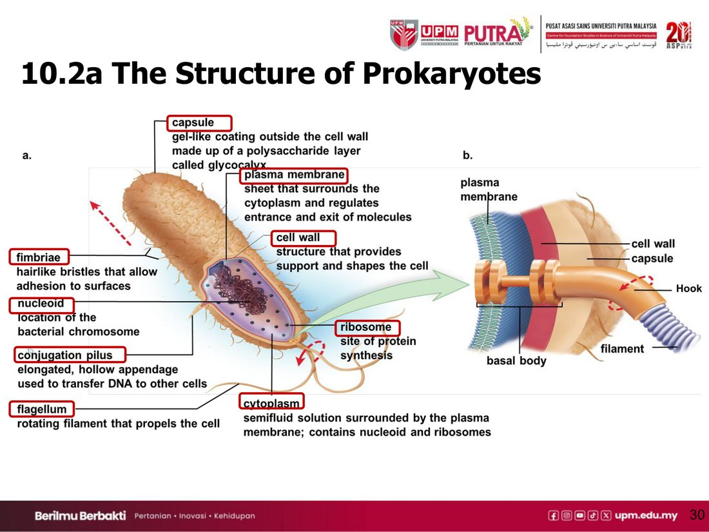

### 10.2b Prokaryotic cell shapes

Bacteria are further classified by three basic shapes — spiral (spirilli), rod (bacilli) and round (cocci) — plus a few variants:

| Name | Description |
|---|---|
| Coccus (pl. cocci) | Round |
| Bacillus (pl. bacilli) | Rod |
| Vibrio (pl. vibrios) | Curved rod |
| Coccobacillus (pl. coccobacilli) | Short rod |
| Spirillum (pl. spirilla) | Spiral |
| Spirochete (pl. spirochetes) | Long, loose, helical spiral |

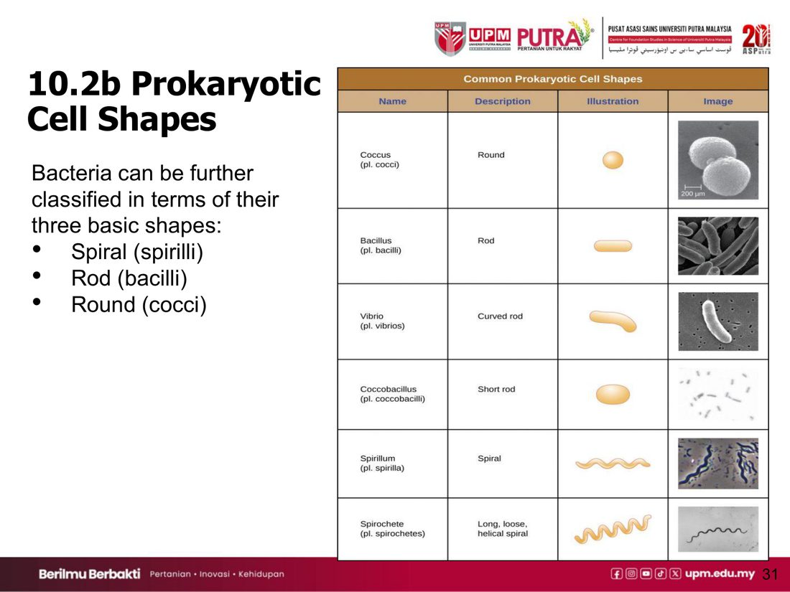

### 10.2c Prokaryote reproduction

Prokaryotes reproduce **asexually by binary fission** — a single cell simply divides in two.

*(The slides don't diagram binary fission itself, only the mechanisms below that exchange DNA between cells — so here's the basic process for reference: a circular chromosome replicates, the two copies separate to opposite ends of the elongating cell, and the cell pinches inward to form two genetically identical daughter cells.)*

*Image: Wikimedia Commons.*

Genetic material can also be exchanged among prokaryotes, causing **genetic recombination**, through three mechanisms:

| Mechanism | What happens |
|---|---|
| **Transduction** | A bacteriophage carries portions of bacterial DNA from one cell to another — the phage serves as a vector. |
| **Conjugation** | A conjugation pilus forms between two cells; the donor cell passes DNA (via a plasmid) to the recipient cell through the pilus. |
| **Transformation** | A bacterium picks up free DNA fragments released by other (often dead) prokaryotes from its environment, which becomes incorporated into its genome. |

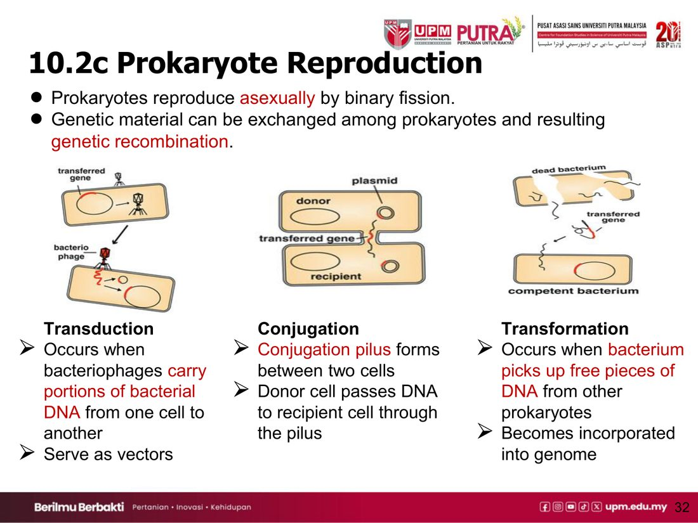

## 10.3 The Bacteria

### 10.3a The structure of bacteria

Most bacterial cells are protected by a cell wall containing **peptidoglycan**. Bacteria are commonly differentiated using the **Gram stain** procedure, based on how much peptidoglycan their cell wall contains:

- **Gram-positive** bacteria **retain** the dye after washing and appear **purple** — they have a thick peptidoglycan layer.
- **Gram-negative** bacteria **do not retain** the dye and appear **pink** — they have a thin peptidoglycan layer plus a **second (outer) plasma membrane**, which blocks antibiotic drugs and makes their infections harder to treat.

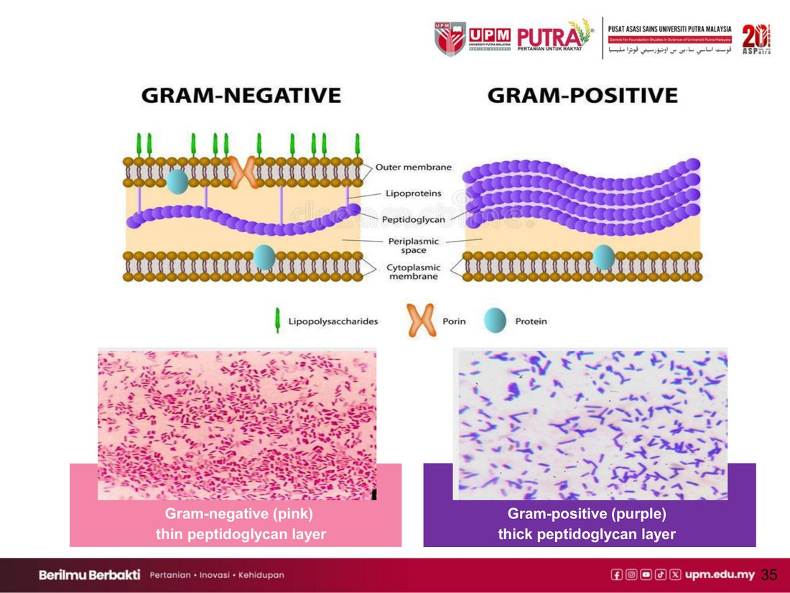

**Endospore-forming bacteria:** some bacteria (e.g. *Bacillus* spp., *Clostridium* spp.) form resistant **endospores** under unfavourable conditions. Endospores can survive without nutrients and resist ultraviolet radiation, desiccation, high temperature, extreme freezing and chemical disinfectants — they can only be destroyed by burning or by **autoclaving**.

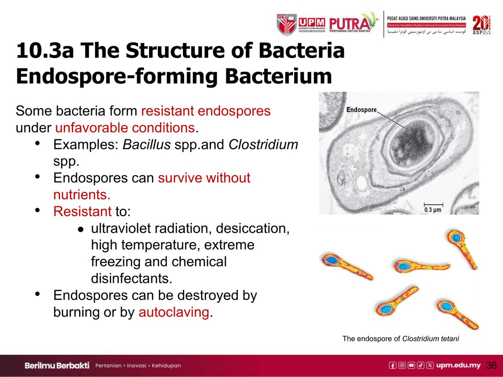

### 10.3b Bacterial oxygen requirements

| Oxygen requirement | Description | Examples |
|---|---|---|
| **Obligate aerobes** | Require oxygen to grow | *Mycobacterium tuberculosis*, *Pseudomonas aeruginosa*, *Bacillus subtilis* |
| **Obligate anaerobes** | Cannot grow in the presence of oxygen | *Clostridium botulinum* (botulism), *Clostridium tetani* (tetanus), *Clostridium perfringens* (gas gangrene) |
| **Facultative anaerobes** | Can grow with or without oxygen — most adaptable | *Escherichia coli*, *Staphylococcus aureus*, *Salmonella enterica* |

### 10.3c Modes of nutrition

| Mode of nutrition | Energy source | Description |
|---|---|---|
| **Photoautotroph** | Sunlight | Uses light energy to synthesise organic compounds (e.g. cyanobacteria) |
| **Chemoautotroph** | Inorganic chemicals | Obtains energy by oxidising inorganic substances like ammonia or hydrogen sulfide |
| **Photoheterotroph** | Sunlight (for energy) + organic carbon | Uses chlorophyll/photosynthetic pigments to trap light energy but gets carbon from other organisms (e.g. purple nonsulfur bacteria) |
| **Chemoheterotroph** | Organic compounds | Depends on organic molecules for both carbon and energy (e.g. decomposers, pathogenic bacteria) |

### 10.3d Bacteria's relationships with other organisms

Bacteria interact with other organisms in both beneficial and harmful ways:

| Interaction | Description | Example |
|---|---|---|
| **Commensalism** | One population modifies the environment so a second population benefits | *E. coli* clearing oxygen in the intestine, allowing anaerobic bacteria to thrive |
| **Mutualism** | Both species benefit | Gut microbiota synthesise vitamins K and B12 for the host, while receiving nutrients and shelter |
| **Parasitism** | The parasite benefits at the host's expense; disease-causing bacteria (pathogens) often form endospores to survive harsh conditions | *Mycobacterium tuberculosis* exploiting host tissues |

**Bacterial diseases in humans**, by category: sexually transmitted (syphilis, gonorrhea, chlamydia), respiratory (strep throat, scarlet fever, tuberculosis, pneumonia, Legionnaires' disease, whooping cough, inhalation anthrax), skin (erysipelas, boils, carbuncles, impetigo, acne, wound infections, leprosy), digestive tract (gastroenteritis, food poisoning, dysentery, cholera, peptic ulcers, dental caries), nervous system (botulism, tetanus, leprosy, spinal meningitis), systemic (plague, typhoid fever, diphtheria), and others (tularemia, Lyme disease).

### 10.3e Antibiotics

**Antibiotics** are medicines that kill bacteria or stop them growing, by targeting processes/structures bacteria specifically need:

- **Protein synthesis** — bacteria need ribosomes to make proteins; some antibiotics (e.g. erythromycin, tetracycline) attach to bacterial ribosomes and block protein production.
- **Cell-wall synthesis** — many bacteria have a peptidoglycan cell wall; penicillin-type antibiotics (e.g. penicillin, ampicillin) interfere with the enzymes needed to build it: **Penicillin → blocks cell-wall construction → weakened bacteria → bacterial death.**

**Why are antibiotics selective for bacteria?** Animal cells don't have peptidoglycan cell walls — so an antibiotic targeting peptidoglycan can selectively attack bacteria without harming an equivalent structure in human cells.

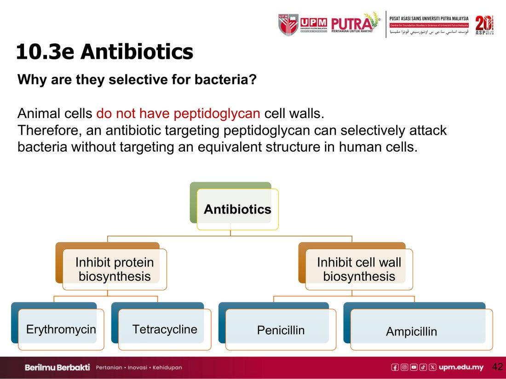

## 10.4 The Archaea

### 10.4a The characteristics of Archaea

- Single-celled, prokaryotic.
- Distinct molecular characteristics separate Archaea from Bacteria — notably, Archaea **do not have peptidoglycan** in their cell walls.
- Archaea are biochemically **more like Eukarya** than Bacteria, and are now thought to be more closely related to Eukarya than to Bacteria.
- Many are **extremophiles** — living in very extreme environments.

### 10.4b Types of Archaea

Archaea are usually classified by habitat and metabolism:

| Archaeal group | Habitat | Metabolic adaptation | Special features |
|---|---|---|---|
| **Methanogens** | Deep ocean sediment, animal guts, wetlands | Produce methane from H₂ and CO₂ (methanogenesis); anaerobic respiration | Specialised enzymes for methane production |
| **Halophiles** | Salt ponds (e.g. Dead Sea, Great Salt Lake) | Require high Na⁺ concentration to grow; maintain osmotic balance | Cell walls/proteins adapted to high salinity |
| **Thermoacidophiles** | Hot acidic springs (e.g. Grand Prismatic Spring, Yellowstone) | Adapted to high temperature and low pH; enzymes stable under extreme conditions | Special heat- and acid-resistant membranes |

*Memory trick: Methano = Methane, Halo = Salt, Thermo = Heat.*

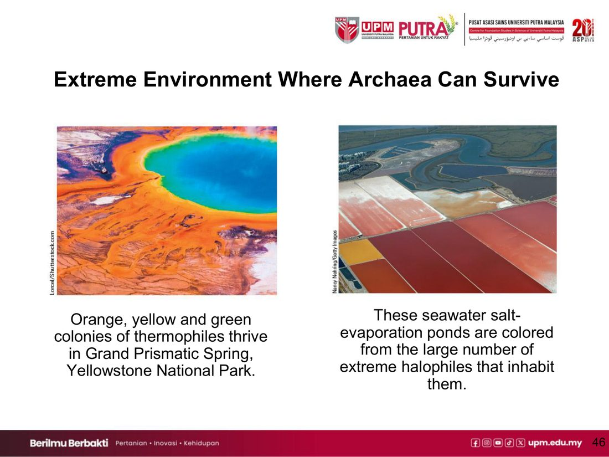

## Summary

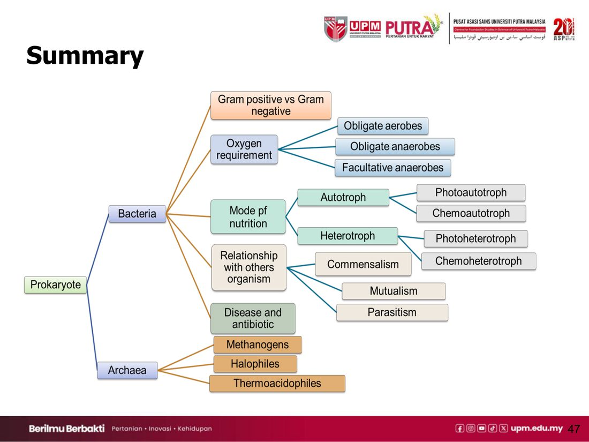

- **Viruses** are obligate intracellular parasites, classified by shape, envelope and nucleic acid type; bacteriophages cycle through lytic (and sometimes lysogenic) reproduction, while retroviruses like HIV use reverse transcription to integrate into the host genome.
- **Prokaryotes** (Bacteria + Archaea) are unicellular, lack a membrane-bound nucleus, and reproduce by binary fission — with DNA additionally exchanged via transduction, conjugation or transformation.
- **Bacteria** are Gram-positive or Gram-negative, vary in oxygen tolerance and nutrition mode, and can be commensal, mutualistic or parasitic; antibiotics selectively target bacterial protein or cell-wall synthesis.
- **Archaea** lack peptidoglycan, are biochemically closer to Eukarya than to Bacteria, and include methanogens, halophiles and thermoacidophiles — many living in extreme environments.

---

**References:** Mader, S. S., & Windelspecht, M. (2019). *Biology* (13th ed.). McGraw-Hill Education. · Solomon, E. P., Martin, C. E., Martin, D. W., & Berg, L. R. (2019). *Biology* (11th ed.). Cengage Learning.
