# Topic 9 — Taxonomy and Systematics

*ASB0204 Biology I, Assoc. Prof. Dr. Marina Mohd. Top @ Mohd. Tah, Biology Unit, ASPutra*

## 9.1 Systematic Biology

### Biodiversity and systematics

- **Biodiversity** — the variety of living organisms and the ecosystems in which they occur.
- **Systematics** — the scientific study of the diversity of organisms and their evolutionary relationships.
- Why bother organising this diversity? Because it lets us answer three questions: how do we **name** organisms, how do we **classify** them, and how do we work out their **evolutionary relationships**.
- Method: **observe** characteristics → **analyse** genetic/molecular evidence → **infer** evolutionary relationships → understand both *what organisms exist* and *how they are related*.

### Taxonomy and classification

Systematics gives the big picture; taxonomy and classification organise it:

- **Systematics** — studies the diversity of organisms and their evolutionary relationships.
- **Taxonomy** — the branch of systematics concerned with the **identification, naming and classification** of organisms (identify → name → classify).
- **Classification** — the process of organising organisms into groups (**taxa**) based on shared characteristics and evolutionary relationships.
- A **taxon** is a named group of organisms at any level of classification (e.g. Mammalia, Primates, Felidae, Homo).

In short: **Systematics** (big picture) → **Taxonomy** (identify, name, classify) → **Classification** (organise into taxa).

Example — classification of humans (*Homo sapiens*), most general to most specific: Domain **Eukarya** → Kingdom **Animalia** → Phylum **Chordata** → Class **Mammalia** → Order **Primates** → Family **Hominidae** → Genus ***Homo*** → Species ***Homo sapiens***.

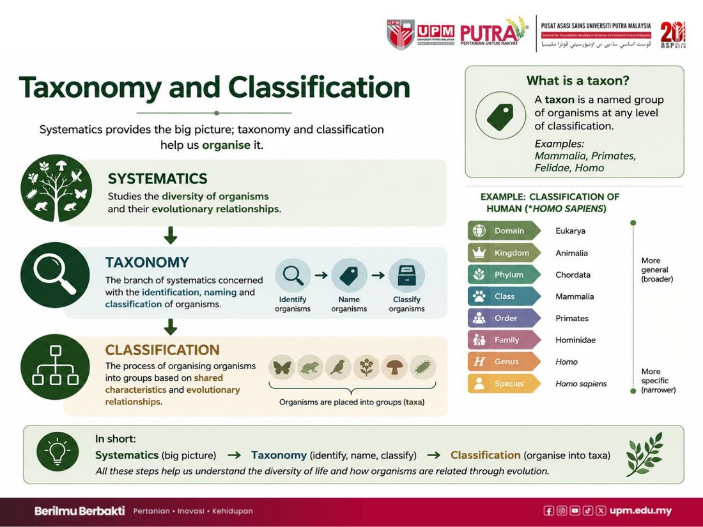

### Early classification of organisms

One of the earliest attempts to classify living things, by **Aristotle** (384–322 BCE), was based mainly on **observable characteristics** — habitat, body form, mode of movement.

Example: a shark and a dolphin both live in water, have streamlined bodies and fins/flippers, and swim efficiently — yet a shark is a **fish** (Class Chondrichthyes) and a dolphin is a **mammal** (Class Mammalia). They are *not* closely related; the similarity comes from adapting to the same environment, not from shared ancestry.

**Key lesson:** observable similarity ≠ evolutionary relationship. This limitation of early classification is what led to modern classification based on **phylogeny** (evolutionary relationships).

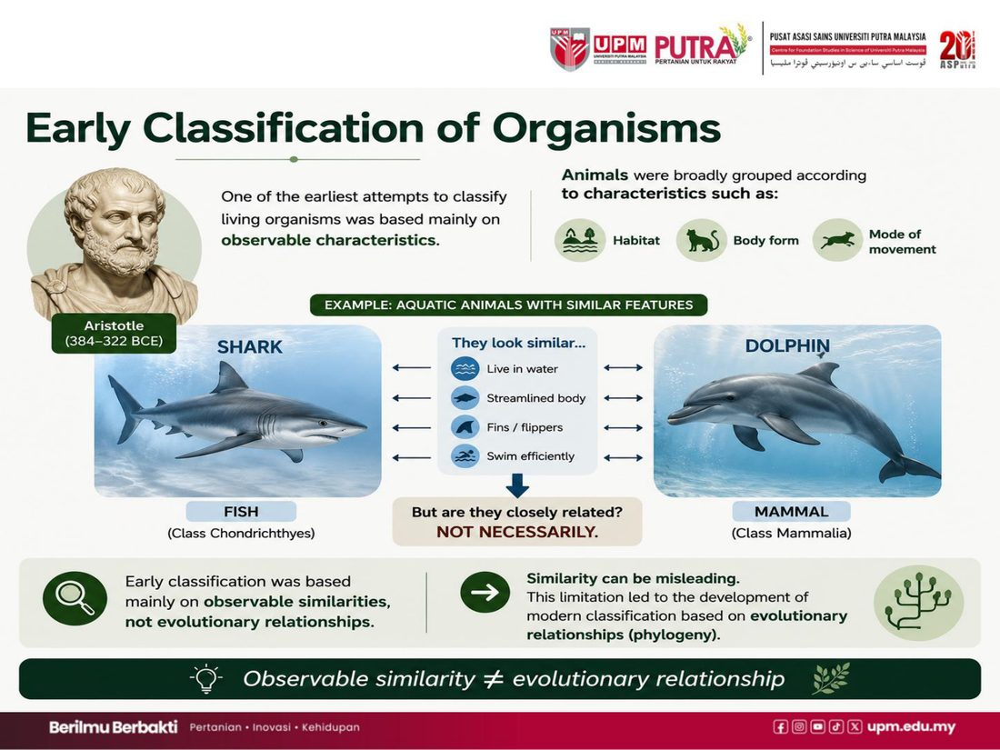

### Modern classification: evolutionary relationships

Modern systematics classifies organisms by their **evolutionary relationships**, using several types of evidence:

1. **Morphology** — observable structures and characteristics.
2. **Molecular data** — DNA, RNA and protein sequences.
3. **Other biological evidence** — development, physiology and behaviour.

Comparing organisms this way reveals **phylogeny**: the evolutionary history and relationships among organisms or groups. A **phylogenetic tree** represents this as a hypothesis about evolutionary relationships — it can change as new evidence is discovered, since science is a continuous process of testing and refining ideas.

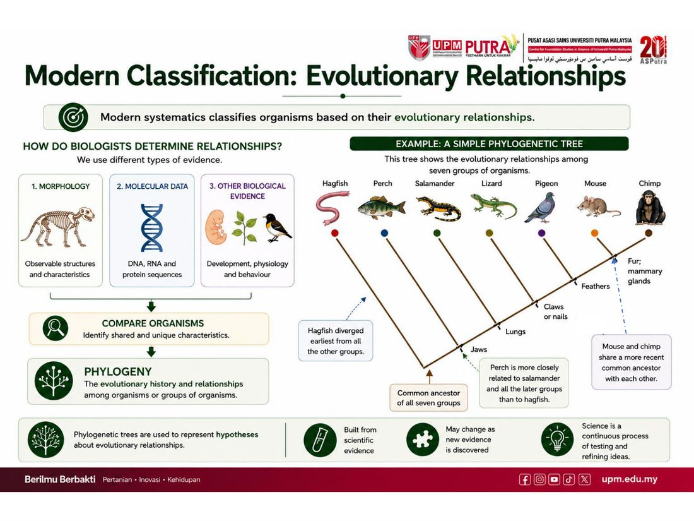

In the example above: the hagfish diverged earliest from the other six groups; the perch is more closely related to the salamander (and everything after it) than to the hagfish; and the mouse and chimp share a more recent common ancestor with each other than with the other groups.

### Binomial nomenclature

**Carolus Linnaeus** (1707–1778) developed the standardised naming system that became the basis of modern biological nomenclature — *"To each species a name, to each name a place."*

**Binomial nomenclature**: each species gets a two-part scientific name — **Genus + specific epithet**. E.g. ***Escherichia coli***: *Escherichia* is the genus (groups closely related species), *coli* is the specific epithet (identifies the particular species within that genus). Together they form the scientific name.

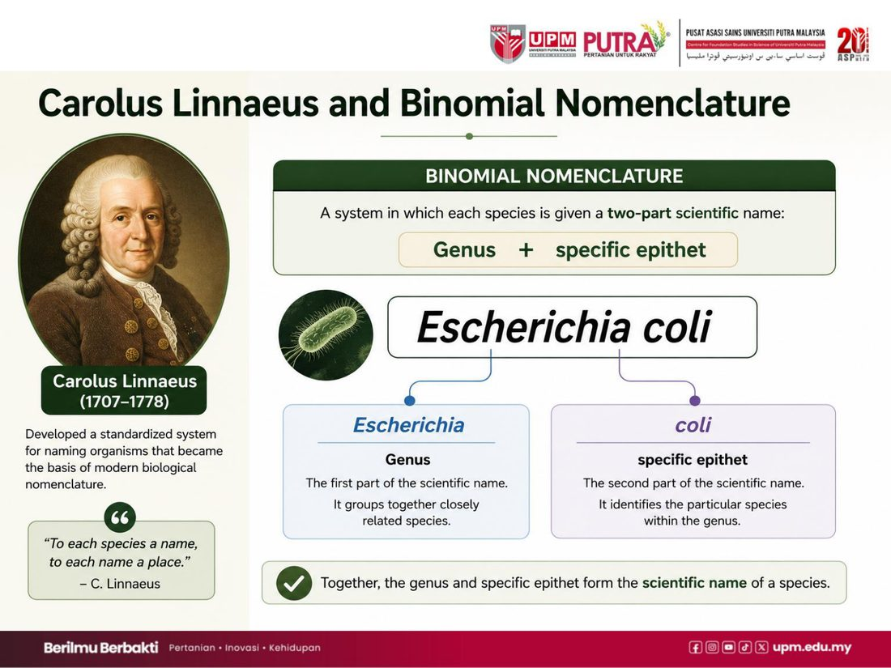

**Rules for writing a scientific name correctly** (e.g. *Lilium canadense*):

| Rule | Detail |
|---|---|
| Two-part name | Genus + specific epithet |
| Capitalisation | Genus starts with a **capital** letter; specific epithet starts with a **lowercase** letter |
| Italicisation | Both words are *italicised* when typed |
| Handwritten names | Each word is <u>underlined separately</u> when handwritten |
| Abbreviation | After writing the name in full once, the genus may be abbreviated (e.g. *Escherichia coli* → *E. coli*) |

Common mistakes: ~~lilium canadense~~ (genus not capitalised), ~~Lilium Canadense~~ (epithet not lowercase), ~~LILIUM CANADENSE~~ (should not be all caps). Also note: the specific epithet must never be used alone as a species name (e.g. "coli" alone is meaningless).

Two species can share a genus but differ in epithet — *Lilium canadense* and *Lilium bulbiferum* both belong to genus *Lilium* but are different species.

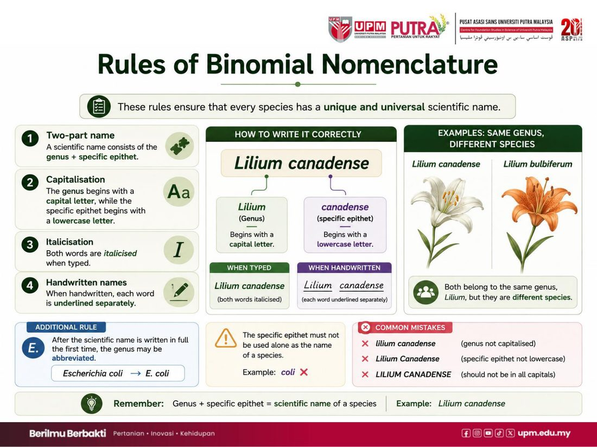

**Why scientific names, not common names?** Common names cause confusion in three ways: the same organism has different names in different languages (harimau bintang / leopard / 豹 / ヒョウ); one species can have several common names (mountain lion = cougar = puma = catamount); and the same common name can mean different organisms ("bat" the mammal vs. "bat" the sports equipment). Scientific names are standardised, internationally recognised, and traditionally Latin or Latinised (Latin being historically the language of scholarship) — removing ambiguity so scientists worldwide can communicate clearly. One species, one scientific name, understood everywhere.

**How are scientific names derived?** Four common sources:

1. **Characteristics** — e.g. *Tyrannosaurus rex* ("tyrant lizard king").
2. **Geographical origin** — e.g. *Alligator mississippiensis* (Mississippi region).
3. **A person** — e.g. *Dendrobium ruseae*, named in honour of Malaysian plant taxonomist Prof. Dr. Rusea Go.
4. **Mythology/culture** — e.g. *Iris versicolor* (Iris = Greek goddess of the rainbow).

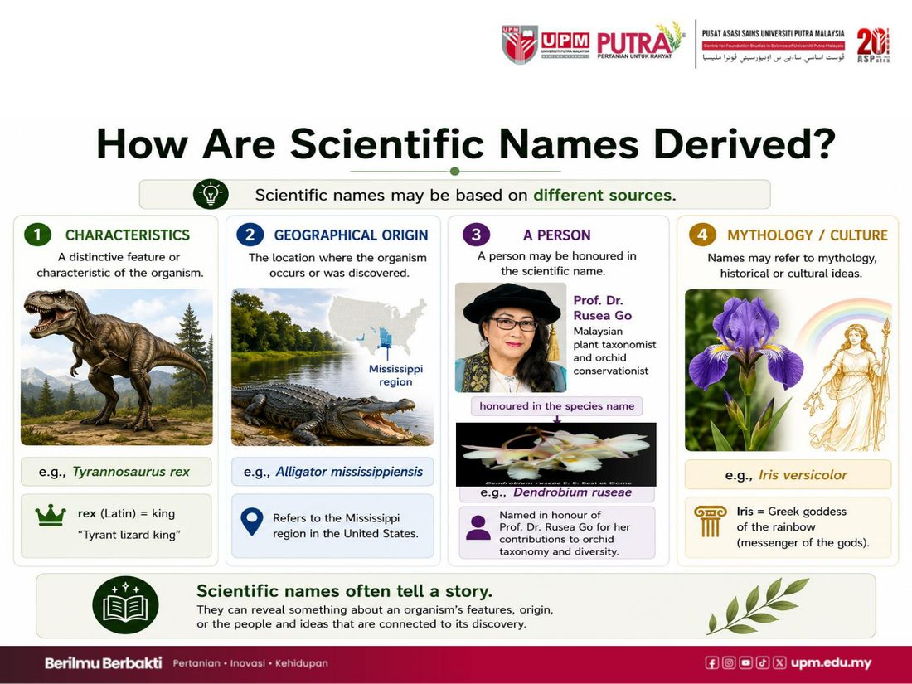

**Fun fact:** the shortest scientific name on record is *Ia io* Thomas (a bat), and one of the longest is *Parastratiosphecomyia stratiosphecomyioides* Brunetti (a fly) — in both cases "Thomas"/"Brunetti" are the taxonomist's name, not part of the species name itself. The ICZN (zoological code) allows **tautonyms** — repetition of genus and epithet, e.g. *Rattus rattus* — but the ICN (botanical/fungal code) does not allow this for plants.

Malaysia has its own share of species named after people — *Rhacophorus norhayatii* (a flying frog), *Rafflesia azlanii*, and *Vanilla norashikiniana* (an orchid):

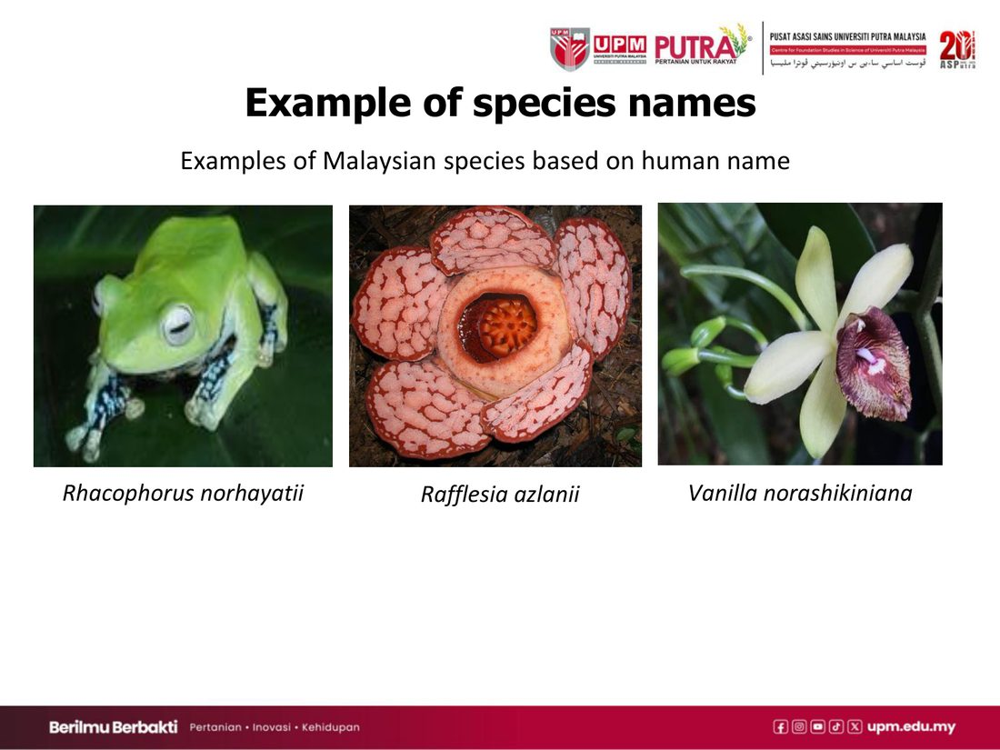

...and, because taxonomists have a sense of humour, species named after fiction/pop culture: *Eriovixia gryffindori* (a spider resembling the Sorting Hat), *Trigonopterus yoda* (a weevil), *Spongiforma squarepantsii* (a sponge-like fungus), *Epicratinus pikachu* (a spider), *Spiralix heisenbergi* (a snail), and *Proctoporus optimus* (a lizard, from Peru).

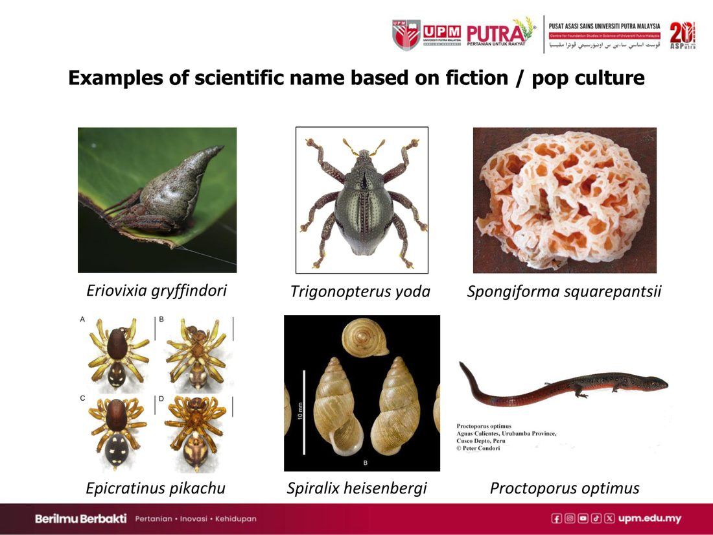

### The Linnaean classification hierarchy

Organisms are classified into a hierarchy of taxonomic ranks, from most inclusive/broadest to most specific/narrowest:

**Domain → Kingdom → Phylum → Class → Order → Family → Genus → Species**

| Rank | Meaning |
|---|---|
| Domain | One or more kingdoms |
| Kingdom | One or more phyla |
| Phylum | One or more classes |
| Class | One or more orders |
| Order | One or more families |
| Family | One or more genera |
| Genus | One or more species |
| Species | The most specific taxonomic rank |

The higher the category, the broader/more inclusive it is; the lower the category, the more specific and the fewer organisms share it.

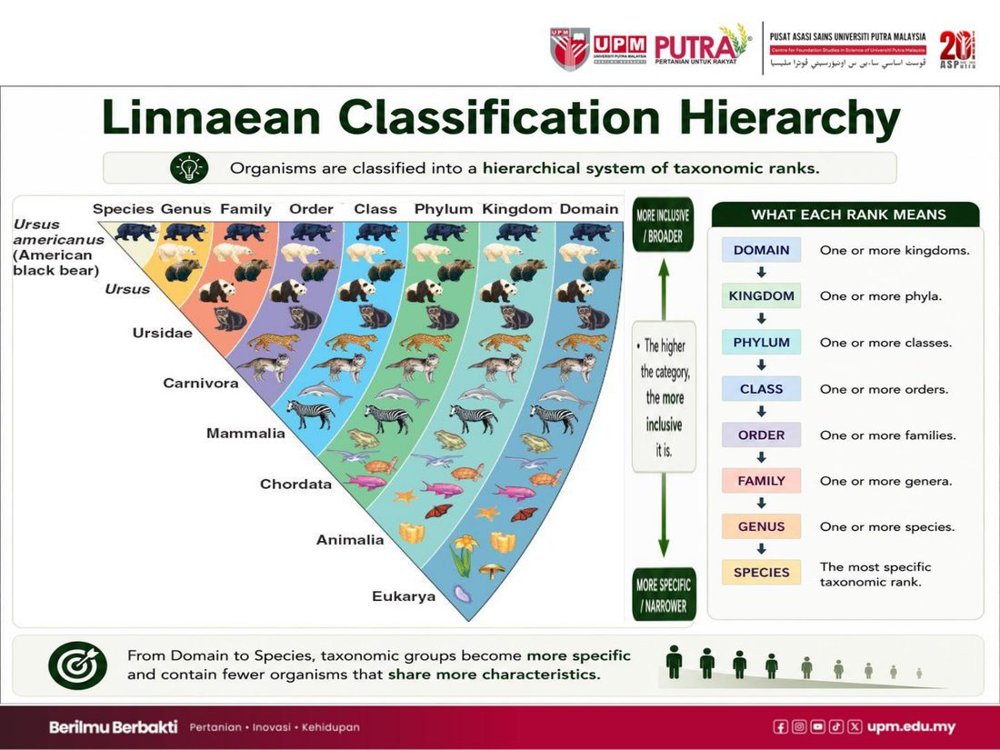

**Worked example — classifying corn (*Zea mays*):**

| Rank | Classification | Why |
|---|---|---|
| Domain | Eukarya | Has nuclei and other membrane-enclosed organelles |
| Kingdom | Plantae | Terrestrial, multicellular, photosynthetic |
| Phylum | Anthophyta | Vascular plant with flowers, fruits and seeds |
| Class | Monocotyledones | Monocot: one seed leaf, flower parts in threes |
| Order | Commelinales | Monocots with reduced flower parts, elongated leaves, dry one-seeded fruits |
| Family | Poaceae | Grasses: hollow stems, fruit is a grain |
| Genus | *Zea* | Tall annual grass with separate male/female flowers |
| Species | *Zea mays* | Corn |

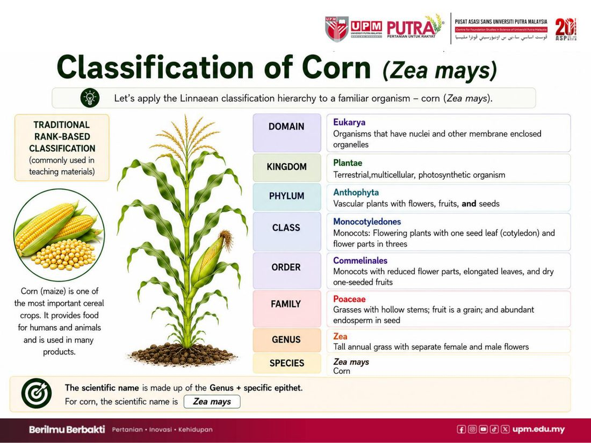

### DNA barcoding

**DNA barcoding** is a molecular technique for identifying species using a short, standardised region of DNA. It compares a DNA fragment from an unknown organism against a large reference database of known sequences.

Steps: **(1)** unknown organism collected → **(2)** DNA extracted → **(3)** barcode region amplified/sequenced → **(4)** DNA sequence (barcode) obtained → **(5)** compared against reference database → **(6)** best match found → **(7)** species identified.

DNA barcoding complements traditional (morphology-based) identification by providing molecular evidence — especially useful for organisms that look alike, or for unknown/rare/fragmentary samples.

## 9.2 The Three-Domain System

### Why classification systems changed

Classification has evolved as scientists gained better tools: microscopes → electron microscopy → biochemical techniques → molecular evidence. Each advance revealed differences among organisms and their evolutionary relationships that earlier, purely observational schemes had missed.

- **Aristotle** (Ancient Greece, 384–322 BCE): **2 kingdoms** — Plantae, Animalia (based on observable characteristics).
- **Ernst Haeckel** (1866): **3 kingdoms** — Protista, Plantae, Animalia (microscopy revealed organisms that didn't fit neatly into Plantae or Animalia).
- **R. H. Whittaker** (1969): **5 kingdoms** — Monera, Protista, Fungi, Plantae, Animalia (classification now considered cell structure and mode of nutrition).

When scientists began comparing **molecular sequences**, this led to the proposal of the **Three-Domain System**.

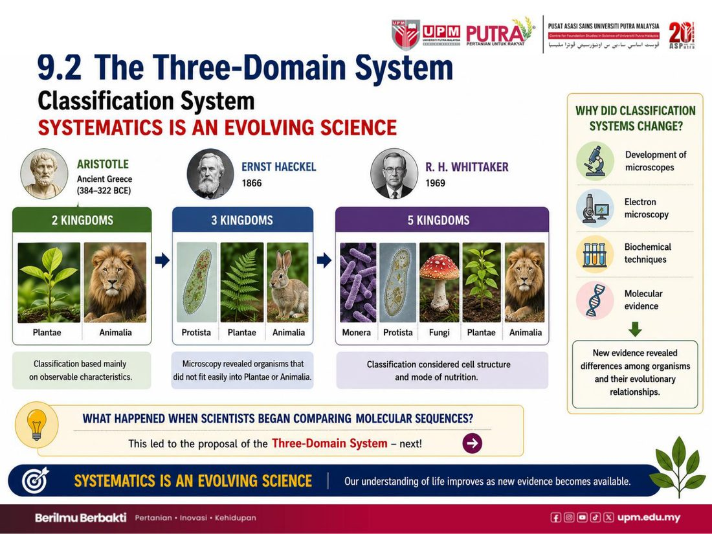

### The three-domain system

Molecular evidence from **ribosomal RNA (rRNA)** comparisons — pioneered by **Carl Woese** in the late 1970s — revealed three major evolutionary lineages of life: **Bacteria**, **Archaea**, and **Eukarya**. Archaea and Eukarya share a more recent common ancestor than either does with Bacteria.

| Domain | Cell type | Notes | Example |
|---|---|---|---|
| **Bacteria** | Prokaryotic | Found in many environments | *Escherichia coli* |
| **Archaea** | Prokaryotic | Often in extreme environments; molecularly distinct from Bacteria | Methanogens |
| **Eukarya** | Eukaryotic | Nucleus + membrane-bound organelles; includes protists, fungi, plants, animals | — |

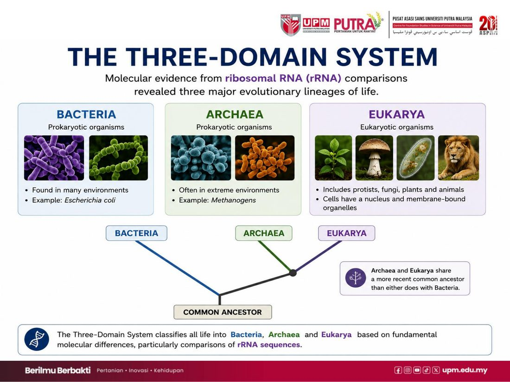

### Domain Bacteria

Bacteria are unicellular prokaryotes found in nearly every environment on Earth.

- **Cellular organisation:** unicellular, prokaryotic, reproduce mainly asexually.
- **Nutrition:** most are heterotrophic; some are photosynthetic (e.g. cyanobacteria).
- **Ecological importance:** important in chemical cycling in ecosystems; some species are pathogenic.

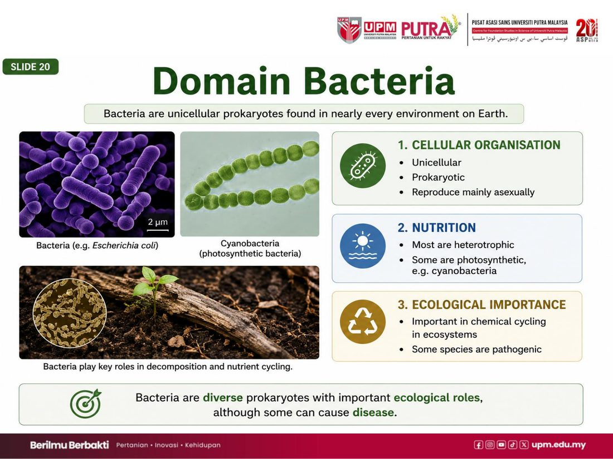

### Domain Archaea

Archaea are unicellular prokaryotes found in both extreme and non-extreme environments.

- **Cellular organisation:** unicellular, prokaryotic, reproduce mainly asexually.
- **Distinctive features:** cell walls differ from Bacteria; rRNA sequences differ from Bacteria; molecular characteristics show a closer evolutionary relationship to **Eukarya** than to Bacteria.
- **Habitat:** many inhabit extreme environments (high temperature, high salinity, oxygen-free), though some live in non-extreme environments too — e.g. hot springs, salt lakes, anaerobic sediment.

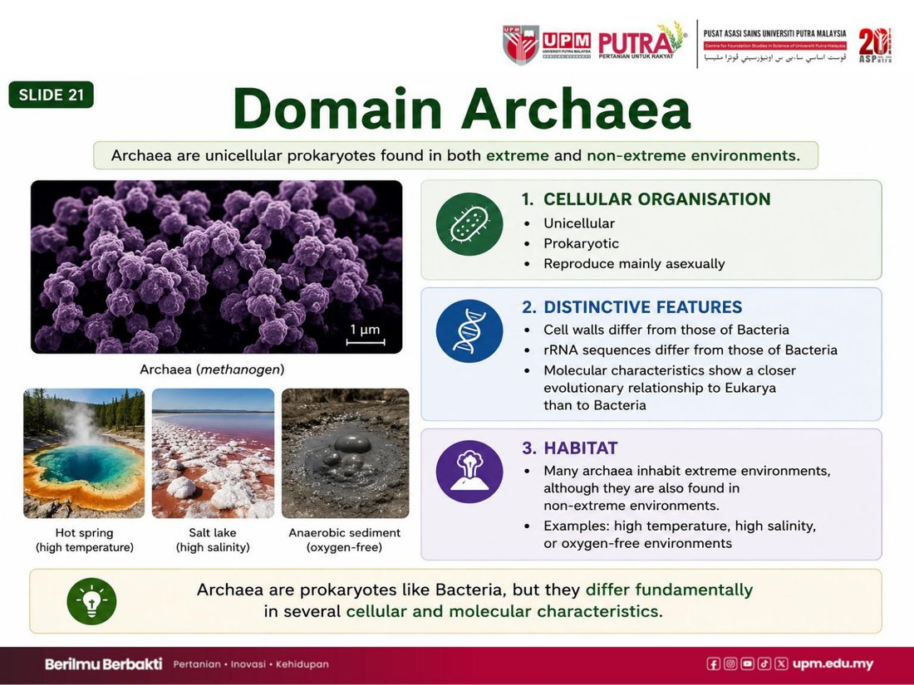

### Domain Eukarya

Eukarya includes unicellular and multicellular organisms whose cells contain a nucleus and membrane-bound organelles.

- **Cellular organisation:** unicellular or multicellular, eukaryotic, membrane-bound nucleus and organelles present.
- **Reproduction:** sexual reproduction is common; asexual reproduction also occurs in many groups.
- Traditionally split into **four kingdoms**: **Protista** (e.g. *Paramecium*), **Fungi** (e.g. mushroom), **Plantae** (e.g. orchid), **Animalia** (e.g. fish) — though molecular evidence continues to refine these evolutionary relationships (organisms once lumped into "Protista" actually represent several distinct lineages).

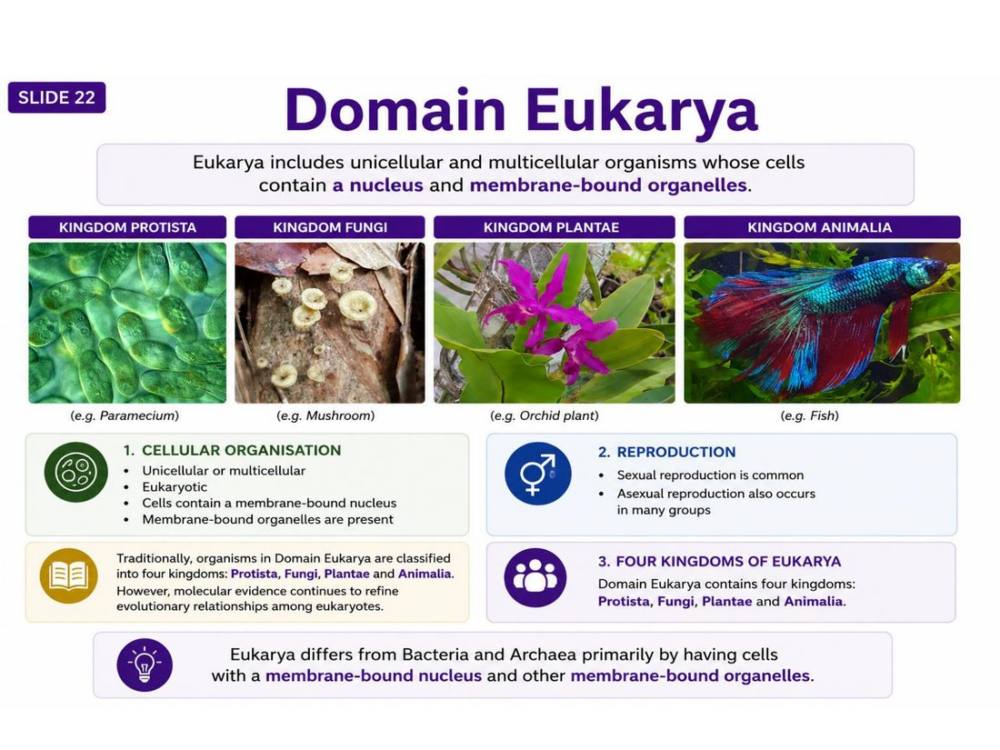

**Reference — domains, kingdoms and their ecological roles:**

| Domain | Kingdom | Characteristics | Ecological role |
|---|---|---|---|
| Bacteria | Bacteria | Prokaryotes, unicellular, microscopic, peptidoglycan cell walls | Mostly decomposers; some pathogenic; some chemosynthetic/photosynthetic; important in nutrient recycling |
| Archaea | Archaea | Prokaryotes, unicellular, microscopic, no peptidoglycan, biochemically distinct from bacteria | Decomposers; methanogens are anaerobes in sewage/swamps/digestive tracts; halophiles in salty water; thermophiles in hot/acidic environments |
| Eukarya | Protista | Eukaryotes, mostly unicellular or simple multicellular | Protozoa are key zooplankton; algae are major primary producers and an O₂ source; some cause disease (e.g. malaria) |
| Eukarya | Plantae | Eukaryotes, multicellular, photosynthetic, cellulose cell walls | Primary producers; major atmospheric O₂ source |
| Eukarya | Fungi | Eukaryotes, heterotrophic, absorb nutrients, chitin cell walls | Decomposers; some pathogenic; symbioses with roots (mycorrhizae) or algae (lichens); used in food/industry |
| Eukarya | Animalia | Eukaryotes, multicellular heterotrophs, most motile via muscle, nervous coordination | Consumers — herbivores, predators, detritus feeders |

**Major distinctions among the three domains:**

| Feature | Bacteria | Archaea | Eukarya |
|---|---|---|---|
| Unicellularity | Yes | Yes | Some — many are multicellular |
| Membrane lipids | Phospholipids, unbranched | Varied, branched lipids | Phospholipids, unbranched |
| Cell wall | Yes (peptidoglycan) | Yes (no peptidoglycan) | Some yes, some no |
| Nuclear envelope | No | No | Yes |
| Membrane-bound organelles | No | No | Yes |
| Ribosomes | Yes | Yes | Yes |
| Introns | No | Some | Yes |

### Summary

- **Systematics** studies diversity and evolutionary relationships; **taxonomy** identifies, names and classifies organisms; **classification** organises them into taxa.
- **Binomial nomenclature** gives every species a two-part name: Genus + specific epithet (e.g. *Homo sapiens*).
- The **Linnaean hierarchy** runs Domain → Kingdom → Phylum → Class → Order → Family → Genus → Species.
- **DNA barcoding** is a molecular tool using a short, standardised DNA region to identify species.
- All life shares a common ancestor, from which **Bacteria**, **Archaea** (both prokaryotic, but molecularly distinct from each other) and **Eukarya** (nucleus + membrane-bound organelles; traditionally split into Protista, Fungi, Plantae, Animalia) diverged.

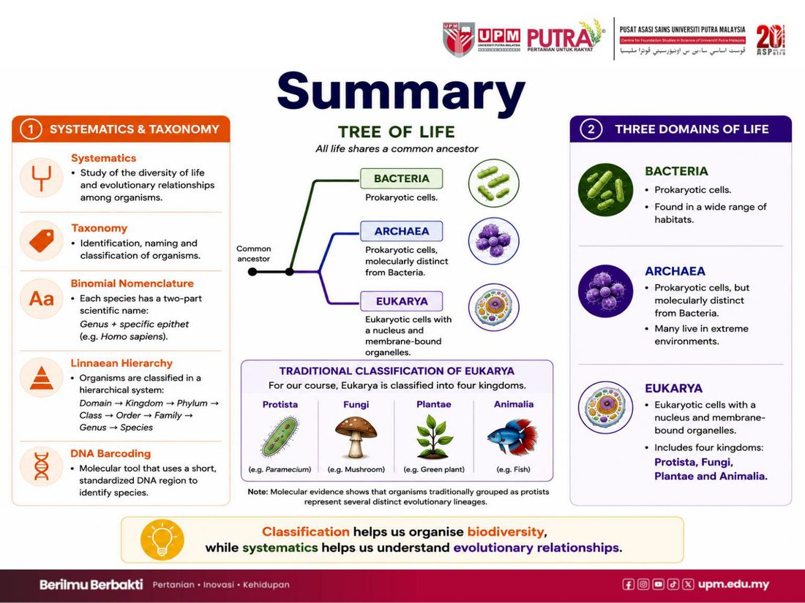

---

**References:** Mader, S. S., & Windelspecht, M. (2019/2021). *Biology* (13th/14th ed.). McGraw-Hill Education. · Solomon, E. P., Martin, C. E., Martin, D. W., & Berg, L. R. (2019). *Biology* (11th ed.). Cengage Learning.
