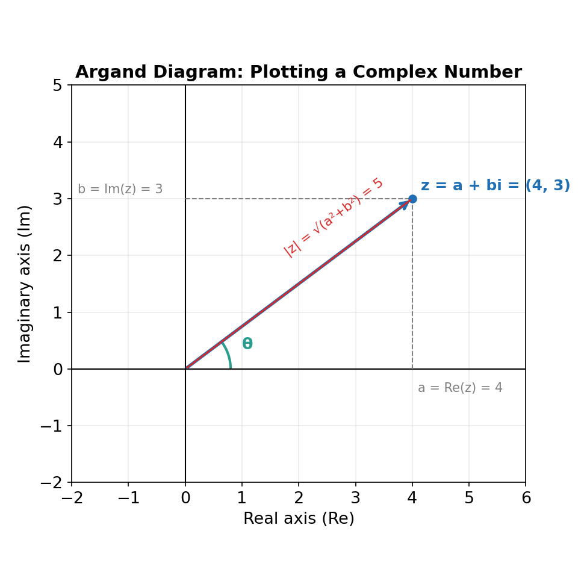
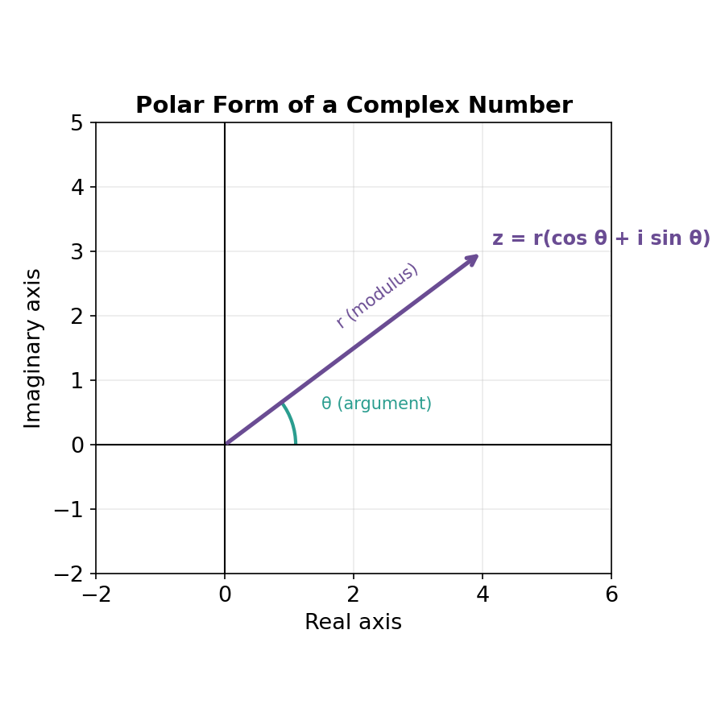

# Chapter 2: Complex Numbers

## The Imaginary Unit

Some quadratic equations (like x² + 1 = 0) have no solution among the real numbers, because no real number squares to a negative value. To solve these, mathematicians define the **imaginary unit i**:

i = √−1,  so that  i² = −1

Any square root of a negative number can then be written in terms of i: √−9 = √9 × √−1 = 3i.

A **complex number** has the form z = a + bi, where a and b are real numbers:
- a is the **real part**, written Re(z)
- b is the **imaginary part**, written Im(z)

If b = 0, z is purely real; if a = 0 and b ≠ 0, z is purely imaginary.

## Operations on Complex Numbers

Complex numbers are added, subtracted, and multiplied like ordinary binomials, always using i² = −1 to simplify.

**Addition/subtraction** (combine like terms):
(3 + 2i) + (1 − 5i) = 4 − 3i

**Multiplication** (expand and simplify using i² = −1):
(2 + 3i)(1 − 4i) = 2 − 8i + 3i − 12i² = 2 − 5i + 12 = 14 − 5i

## Complex Conjugates and Division

The **conjugate** of z = a + bi is z̄ = a − bi (flip the sign of the imaginary part). A key property:

z · z̄ = (a + bi)(a − bi) = a² + b²  (always a real number)

This is used to divide complex numbers: multiply the numerator and denominator by the conjugate of the denominator to clear i from the bottom.

Example: (3 + i) / (1 − 2i)

= (3 + i)(1 + 2i) / [(1 − 2i)(1 + 2i)] = (3 + 6i + i + 2i²) / (1 + 4) = (1 + 7i) / 5 = 1/5 + (7/5)i

## The Argand Diagram

A complex number z = a + bi can be plotted as the point (a, b) on a coordinate plane called the **Argand diagram**, where the horizontal axis is the real axis and the vertical axis is the imaginary axis.

Two quantities describe the position of z geometrically:

- **Modulus** |z| = √(a² + b²) — the distance from the origin to the point (the length of the vector).
- **Argument** θ = arg(z) = tan⁻¹(b/a) — the angle the vector makes with the positive real axis (adjusted for the correct quadrant).

For z = 4 + 3i: |z| = √(16 + 9) = √25 = 5, and θ = tan⁻¹(3/4) ≈ 36.87°.

## Polar Form

Using the modulus r = |z| and argument θ, any complex number can be written in **polar form**:

z = r(cos θ + i sin θ)

This form is especially useful for multiplying and dividing complex numbers, and for raising them to powers, since angles simply add or subtract:

- If z₁ = r₁(cos θ₁ + i sin θ₁) and z₂ = r₂(cos θ₂ + i sin θ₂), then:
  z₁z₂ = r₁r₂[cos(θ₁ + θ₂) + i sin(θ₁ + θ₂)]
  z₁/z₂ = (r₁/r₂)[cos(θ₁ − θ₂) + i sin(θ₁ − θ₂)]

**Converting to polar form** — example: write z = 1 + √3 i in polar form.

- r = √(1² + (√3)²) = √4 = 2
- θ = tan⁻¹(√3/1) = 60°
- z = 2(cos 60° + i sin 60°)
