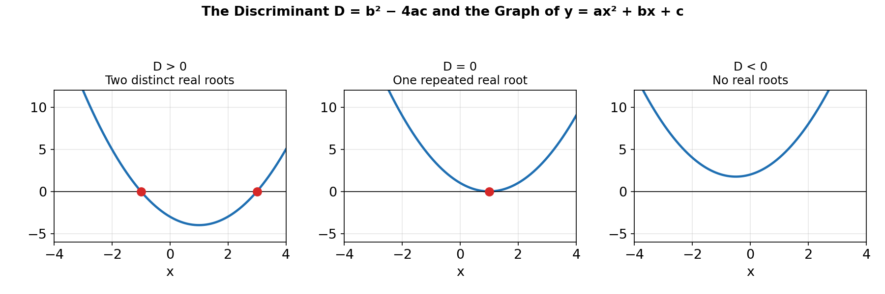
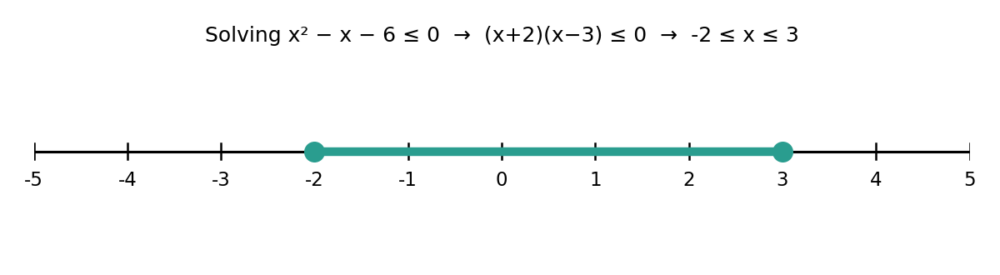

# Chapter 4: Equations, Inequalities and Absolute Values

## Solving Quadratic Equations

A quadratic equation has the form ax² + bx + c = 0 (a ≠ 0). There are three standard methods:

**1. Factorisation** — write ax² + bx + c as a product of two linear factors and set each to zero.
x² − 5x + 6 = 0 → (x − 2)(x − 3) = 0 → x = 2 or x = 3

**2. Completing the square** — rewrite the equation as a perfect square plus a constant.
x² + 6x + 2 = 0 → (x + 3)² − 9 + 2 = 0 → (x + 3)² = 7 → x = −3 ± √7

**3. The quadratic formula** — always works, for any a, b, c:

x = [−b ± √(b² − 4ac)] / 2a

## The Discriminant

The expression **D = b² − 4ac** under the square root in the quadratic formula determines the nature of the roots without fully solving the equation:

| Discriminant | Nature of roots |
|---|---|
| D > 0 | two distinct real roots |
| D = 0 | one repeated real root (the parabola touches the x-axis) |
| D < 0 | no real roots (the parabola does not cross the x-axis) |

## Sum and Product of Roots

If a quadratic ax² + bx + c = 0 has roots α and β, then without solving for the roots individually:

- Sum of roots: α + β = −b/a
- Product of roots: α·β = c/a

This lets you build a new quadratic from known roots, or find one root given the other and the equation's coefficients.

## Linear and Quadratic Inequalities

Inequalities are solved similarly to equations, but the solution is typically a **range** of values rather than a single number, and is best expressed and verified using a sign diagram or number line.

**Method for a quadratic inequality** (e.g. x² − x − 6 ≤ 0):
1. Move everything to one side and factorise: (x + 2)(x − 3) ≤ 0
2. Find the critical values (roots): x = −2 and x = 3
3. Test the sign of the expression in each region formed by the critical values on the number line
4. Select the region(s) satisfying the inequality

Solution: x ∈ [−2, 3].

Three equivalent approaches are commonly taught for these problems: the **sign-table (test-point) method** shown above, the **graphical method** (sketch the parabola and read off where it lies below/above the x-axis), and the **critical-value/interval method** (write the solution directly from the position of the roots and the direction the parabola opens).

## Rational Inequalities

A rational inequality involves a fraction with x in the denominator, e.g. (x − 1)/(x + 2) ≥ 0. These require extra care because:
- The critical values include both the zeros of the numerator **and** the zeros of the denominator (since the denominator cannot equal zero).
- Multiplying both sides by an expression containing x is dangerous, because its sign may be unknown — it is safer to move everything to one side and analyze the sign of the single resulting fraction, rather than cross-multiplying.

**Two standard methods** are used: (1) the sign-table method, testing the sign of the whole rational expression across each interval defined by all critical values, and (2) rearranging so one side is zero, then combining into a single fraction before sign-testing.

Example: solve (x − 1)/(x + 2) ≥ 0.
Critical values: x = 1 (numerator zero) and x = −2 (denominator zero, excluded from the solution).
Testing intervals gives: x ∈ (−∞, −2) ∪ [1, ∞).

## Absolute Value Equations and Inequalities

The **absolute value** |x| is the distance of x from zero on the number line, always non-negative.

**Solving |x| = k** (for k ≥ 0): x = k or x = −k.
Example: |2x − 1| = 5 → 2x − 1 = 5 or 2x − 1 = −5 → x = 3 or x = −2.

**Solving |x| < k** (for k > 0): this means x is within k of zero, so −k < x < k.
Example: |x − 3| < 2 → −2 < x − 3 < 2 → 1 < x < 5.

**Solving |x| > k** (for k > 0): this means x is farther than k from zero, so x < −k or x > k.
Example: |x + 1| > 4 → x + 1 < −4 or x + 1 > 4 → x < −5 or x > 3.
