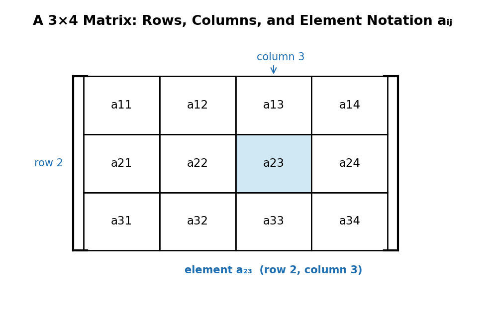

# Chapter 6: Matrices

## What Is a Matrix?

A **matrix** is a rectangular array of numbers arranged in rows and columns. A matrix with m rows and n columns is said to have **dimension** (or order) m × n. Each entry is called an **element**, and the element in row i, column j is denoted aᵢⱼ.

Two matrices are **equal** only if they have the same dimension and every corresponding element is equal.

## Basic Matrix Operations

- **Addition/subtraction:** matrices must have the same dimension; add or subtract corresponding elements.
- **Zero matrix:** a matrix in which every element is 0, the additive identity for matrix addition.
- **Additive inverse:** −A, the matrix with every element of A negated, so that A + (−A) = the zero matrix.
- **Scalar multiplication:** multiply every element of the matrix by the scalar.
- **Transpose (Aᵀ):** the matrix formed by turning the rows of A into columns (and columns into rows).
- **Trace:** the sum of the elements on the main diagonal of a square matrix.

## Special Types of Matrices

| Type | Definition |
|---|---|
| Triangular | all entries above (or below) the main diagonal are zero |
| Symmetric | A = Aᵀ (the matrix equals its own transpose) |
| Skew-symmetric | A = −Aᵀ (transposing negates every element; the diagonal must be all zeros) |
| Identity (I) | 1's on the main diagonal, 0's elsewhere — the multiplicative identity |

## Matrix Multiplication

Two matrices A (m × n) and B (n × p) can be multiplied only if the number of **columns of A equals the number of rows of B**. The result AB is an m × p matrix, where each element is found by taking the dot product of a row of A with a column of B:

(AB)ᵢⱼ = Σₖ aᵢₖbₖⱼ

Matrix multiplication is **not commutative** in general — AB ≠ BA — and is only defined when the dimensions are compatible.

## Finding the Inverse via Elementary Row Operations (ERO)

A square matrix A has an inverse A⁻¹ (satisfying AA⁻¹ = A⁻¹A = I) only if A is **non-singular** (its determinant is non-zero). One method to find A⁻¹ is:

1. Write the augmented matrix [A | I].
2. Apply elementary row operations (swap rows, multiply a row by a non-zero scalar, add a multiple of one row to another) until the left side becomes the identity matrix.
3. The right side is then A⁻¹: [I | A⁻¹].

If, during this process, a row of the left-hand side becomes entirely zero, the matrix has no inverse.

## Determinants

**2×2 determinant:** for A = [[a, b], [c, d]], det(A) = ad − bc.

**2×2 inverse:** A⁻¹ = 1/det(A) × [[d, −b], [−c, a]], provided det(A) ≠ 0.

**Minors and cofactors (for larger matrices):** the **minor** Mᵢⱼ of an element is the determinant of the smaller matrix left after deleting row i and column j. The **cofactor** Cᵢⱼ = (−1)ⁱ⁺ʲMᵢⱼ applies an alternating sign based on position.

**3×3 determinant via cofactor expansion** (expanding along the first row):

det(A) = a₁₁C₁₁ + a₁₂C₁₂ + a₁₃C₁₃

## The Adjoint Method for the Inverse

The **adjoint** (or adjugate) of A is the transpose of the matrix of cofactors: adj(A) = [Cᵢⱼ]ᵀ. The inverse of a square matrix can then be computed directly as:

A⁻¹ = adj(A) / det(A),  provided det(A) ≠ 0

This gives a second, purely computational route to the inverse (alongside the row-reduction / ERO method above), particularly convenient for 3×3 matrices once all nine cofactors have been found.
