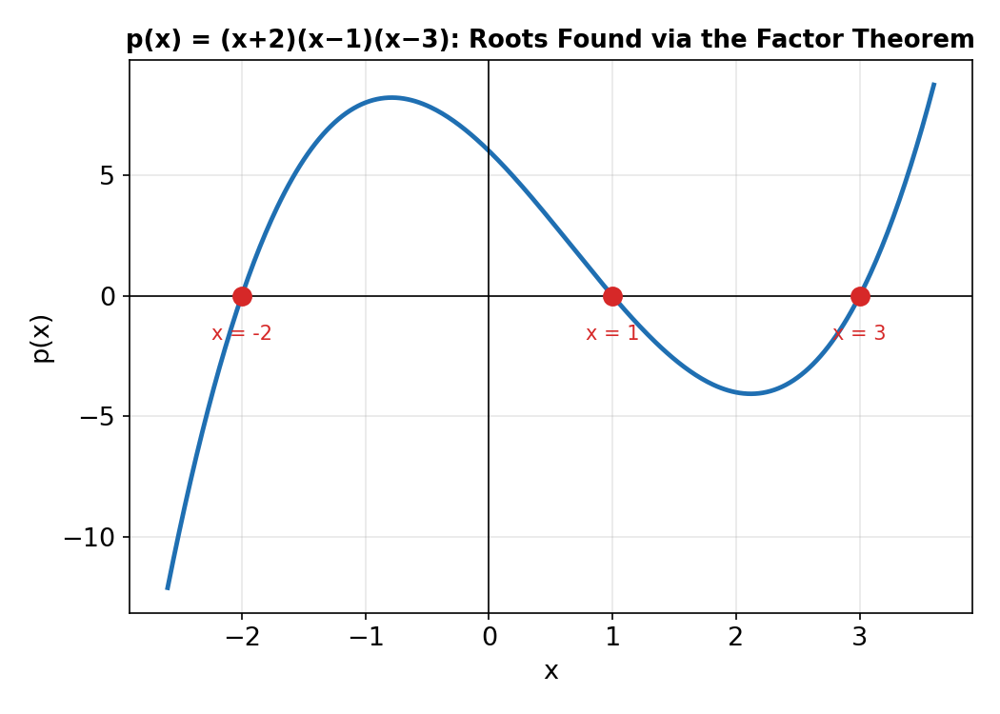

# Chapter 5: Polynomials

## What Is a Polynomial?

A **polynomial** in x is an expression of the form aₙxⁿ + aₙ₋₁xⁿ⁻¹ + … + a₁x + a₀, where the coefficients aᵢ are real numbers and n is a non-negative integer. The **degree** of the polynomial is the highest power of x with a non-zero coefficient. Polynomials of low degree have special names:

| Degree | Name | Example |
|---|---|---|
| 0 | constant | 5 |
| 1 | linear | 2x + 1 |
| 2 | quadratic | x² − 3x + 2 |
| 3 | cubic | x³ + 2x² − x |
| 4 | quartic | x⁴ − 1 |

## Algebraic Operations on Polynomials

Polynomials can be added, subtracted, and multiplied like ordinary algebraic expressions:

- **Addition/subtraction:** combine like terms (same power of x).
  (2x³ + 3x − 1) + (x³ − 5x + 4) = 3x³ − 2x + 3
- **Multiplication:** distribute every term of one polynomial over every term of the other, then combine like terms.
  (x + 2)(x² − x + 3) = x³ − x² + 3x + 2x² − 2x + 6 = x³ + x² + x + 6

## Dividing Polynomials

**Long division** of polynomials mirrors long division of numbers: divide, multiply, subtract, bring down, and repeat until the remainder has a lower degree than the divisor. For a division p(x) ÷ d(x), the result is written:

p(x) = d(x)·q(x) + r(x)

where q(x) is the quotient and r(x) is the remainder (with degree less than d(x)).

**Synthetic division** is a faster shortcut for dividing by a linear factor (x − k): only the coefficients are written down, and a chain of multiply-and-add steps replaces the full long-division layout. It gives the same quotient and remainder as long division, but is quicker when the divisor is linear.

## The Remainder Theorem

If a polynomial p(x) is divided by (x − k), the remainder equals p(k) — the value of the polynomial evaluated at x = k. This means the remainder can be found **without doing any division at all**.

Example: find the remainder when p(x) = x³ − 4x² + 5 is divided by (x − 2).

Remainder = p(2) = 2³ − 4(2)² + 5 = 8 − 16 + 5 = −3

## The Factor Theorem

The Factor Theorem is a direct consequence of the Remainder Theorem: **(x − k) is a factor of p(x) if and only if p(k) = 0.** This is the standard tool for finding the roots of higher-degree polynomials — test small integer values (usually factors of the constant term) until one gives p(k) = 0, then divide it out and repeat on the reduced polynomial.

Example: factorise p(x) = x³ − 2x² − 5x + 6 completely.

Testing x = 1: p(1) = 1 − 2 − 5 + 6 = 0, so (x − 1) is a factor.
Dividing p(x) by (x − 1) gives x² − x − 6, which factors as (x − 3)(x + 2).
So p(x) = (x − 1)(x − 3)(x + 2), with roots x = 1, 3, −2.

## Partial Fractions

**Partial fraction decomposition** reverses the process of combining fractions over a common denominator: a single complicated rational expression is split into a sum of simpler fractions. This is used extensively in calculus (for integration) and in solving certain differential equations. The technique used depends on the type of factor in the denominator:

| Case | Denominator factor | Partial fraction form |
|---|---|---|
| 1 | Distinct linear factors: (x − a)(x − b) | A/(x − a) + B/(x − b) |
| 2 | Repeated linear factor: (x − a)² | A/(x − a) + B/(x − a)² |
| 3 | Distinct irreducible quadratic: (x² + px + q) | (Ax + B)/(x² + px + q) |
| 4 | Improper fraction (degree of numerator ≥ degree of denominator) | perform division first, then decompose the proper remainder |

Example (Case 1): decompose (3x + 5)/[(x + 1)(x + 2)].

Write (3x + 5)/[(x+1)(x+2)] = A/(x+1) + B/(x+2). Multiplying through by the denominator:
3x + 5 = A(x + 2) + B(x + 1)

Setting x = −1: 2 = A(1) → A = 2. Setting x = −2: −1 = B(−1) → B = 1.

So (3x + 5)/[(x+1)(x+2)] = 2/(x+1) + 1/(x+2).
