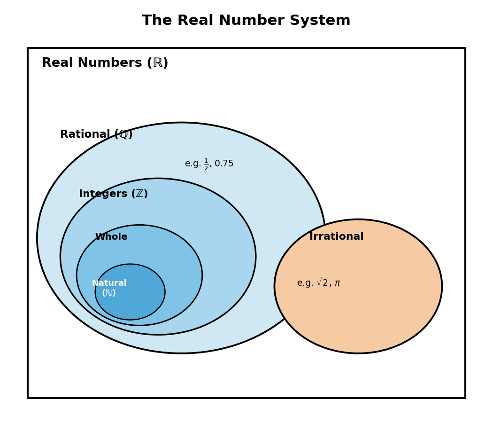
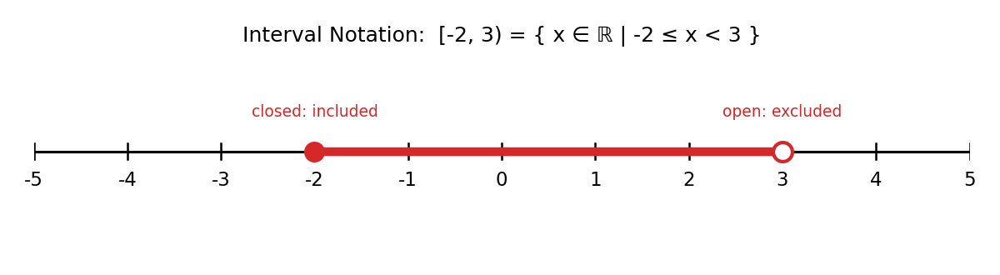

# Chapter 1: Real Numbers

## The Real Number System

Numbers are organised into nested sets. Every natural number is an integer, every integer is rational, and every rational number is real — but real numbers also include irrational numbers, which cannot be written as a fraction.

- **Natural numbers (ℕ):** 1, 2, 3, 4, … (sometimes including 0)
- **Integers (ℤ):** …, -2, -1, 0, 1, 2, … (whole numbers, positive, negative, and zero)
- **Rational numbers (ℚ):** any number that can be written as a fraction a/b, where a and b are integers and b ≠ 0. This includes terminating and repeating decimals (e.g. 1/2, 0.75, -3, 0.333…)
- **Irrational numbers:** numbers that cannot be written as a fraction — their decimal expansion never terminates or repeats (e.g. √2, π, e)
- **Real numbers (ℝ):** the union of the rational and irrational numbers — every point on the number line.

## Intervals and Set Notation

An interval is a set of real numbers between two endpoints. Round brackets mean the endpoint is **excluded** (open); square brackets mean it is **included** (closed).

| Notation | Meaning | Set-builder form |
|---|---|---|
| (a, b) | strictly between a and b | {x ∈ ℝ \| a < x < b} |
| [a, b] | between a and b, inclusive | {x ∈ ℝ \| a ≤ x ≤ b} |
| [a, b) | includes a, excludes b | {x ∈ ℝ \| a ≤ x < b} |
| (a, ∞) | everything greater than a | {x ∈ ℝ \| x > a} |
| (-∞, b] | everything up to and including b | {x ∈ ℝ \| x ≤ b} |

## Linear Inequalities

Solving a linear inequality follows the same steps as solving an equation, **except that multiplying or dividing both sides by a negative number reverses the inequality sign.**

Example: solve 3 − 2x ≥ 7.

- −2x ≥ 4
- x ≤ −2 (divide by −2, so the sign flips)

Solution: x ∈ (−∞, −2].

## Indices (Exponent Laws)

For real numbers a, b and rational exponents m, n (with a, b ≠ 0 where needed):

- aᵐ · aⁿ = aᵐ⁺ⁿ
- aᵐ ÷ aⁿ = aᵐ⁻ⁿ
- (aᵐ)ⁿ = aᵐⁿ
- (ab)ⁿ = aⁿbⁿ
- a⁰ = 1
- a⁻ⁿ = 1/aⁿ
- a^(1/n) = ⁿ√a (the n-th root of a)

## Surds

A **surd** is an irrational root, such as √2 or ³√5, left in root form because its decimal value never terminates. Surds are simplified by factoring out perfect squares (or perfect n-th powers):

√50 = √(25 × 2) = √25 × √2 = 5√2

**Rules for combining surds:**
- √a × √b = √(ab)
- √a ÷ √b = √(a/b)
- Only "like surds" (same number under the root) can be added or subtracted: 3√2 + 5√2 = 8√2

### Conjugate Surds and Rationalisation

The **conjugate** of a + √b is a − √b (and vice versa). Multiplying a surd expression by its conjugate eliminates the root, because (a + √b)(a − √b) = a² − b.

**Rationalising the denominator** means rewriting a fraction so no surd remains on the bottom, by multiplying top and bottom by the conjugate of the denominator:

1/(3 + √2) = (3 − √2) / [(3 + √2)(3 − √2)] = (3 − √2) / (9 − 2) = (3 − √2)/7

## Logarithms

A logarithm answers the question "to what power must the base be raised to get this number?" If aˣ = N (with a > 0, a ≠ 1), then logₐN = x.

**Laws of logarithms** (for a > 0, a ≠ 1, and M, N > 0):

- logₐ(MN) = logₐM + logₐN
- logₐ(M/N) = logₐM − logₐN
- logₐ(Mⁿ) = n·logₐM
- logₐa = 1, and logₐ1 = 0
- **Change of base:** logₐN = log N / log a (using any convenient base, such as base 10 or base e)

Example: solve log₂(x) + log₂(x − 2) = 3.

- log₂[x(x − 2)] = 3
- x(x − 2) = 2³ = 8
- x² − 2x − 8 = 0 → (x − 4)(x + 2) = 0 → x = 4 or x = −2

Since x − 2 must be positive for the original logarithm to be defined, x = −2 is rejected. **Solution: x = 4.**
