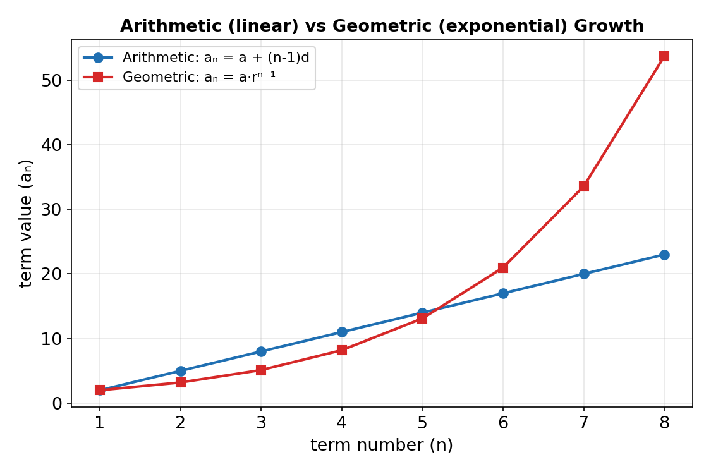

# Chapter 3: Sequences and Progressions

## What Is a Sequence?

A **sequence** is an ordered list of numbers, called **terms**, usually following a pattern or rule. The n-th term of a sequence is written aₙ (or Tₙ, uₙ). This chapter focuses on two important types: arithmetic and geometric sequences (also called progressions).

## Arithmetic Sequences (AP)

An **arithmetic progression** is a sequence in which each term is obtained from the previous one by adding a fixed number, the **common difference d**.

- General term: aₙ = a + (n − 1)d, where a is the first term.
- Common difference: d = aₙ₊₁ − aₙ (the same for every consecutive pair of terms).

Example: 3, 7, 11, 15, … has a = 3 and d = 4, so the 10th term is a₁₀ = 3 + (10−1)(4) = 39.

### Sum of an Arithmetic Series

The sum of the first n terms of an arithmetic sequence:

Sₙ = n/2 [2a + (n − 1)d]   or equivalently   Sₙ = n/2 (a + l), where l is the last (n-th) term.

Example: find the sum of the first 20 terms of 3, 7, 11, 15, …

S₂₀ = 20/2 [2(3) + (20−1)(4)] = 10[6 + 76] = 820

## Geometric Sequences (GP)

A **geometric progression** is a sequence in which each term is obtained from the previous one by multiplying by a fixed number, the **common ratio r**.

- General term: aₙ = a·rⁿ⁻¹, where a is the first term.
- Common ratio: r = aₙ₊₁ / aₙ (the same for every consecutive pair of terms).

Example: 2, 6, 18, 54, … has a = 2 and r = 3, so the 6th term is a₆ = 2(3)⁵ = 486.

### Sum of a Geometric Series

The sum of the first n terms of a geometric sequence (for r ≠ 1):

Sₙ = a(1 − rⁿ) / (1 − r)   (useful when |r| < 1)
Sₙ = a(rⁿ − 1) / (r − 1)   (useful when |r| > 1 — algebraically identical, just avoids a negative-over-negative)

Example: find the sum of the first 8 terms of 2, 6, 18, 54, …

S₈ = 2(3⁸ − 1) / (3 − 1) = 2(6561 − 1)/2 = 6560

### Infinite Geometric Series

If the common ratio satisfies |r| < 1, the terms shrink toward zero and the sum of **infinitely many** terms converges to a finite value:

S∞ = a / (1 − r),  valid only when −1 < r < 1

Example: find the sum to infinity of 8, 4, 2, 1, … (a = 8, r = 1/2).

S∞ = 8 / (1 − 1/2) = 8 / (1/2) = 16

If |r| ≥ 1, the series does not converge and has no finite sum.

## Applications

Arithmetic and geometric progressions model real situations such as evenly-spaced payments or savings (arithmetic), and compound interest, population growth, or radioactive decay (geometric). A typical applied question gives a real-world context (e.g. a salary that increases by a fixed amount each year, or an investment that grows by a fixed percentage each year) and asks for a specific term or a cumulative total, which is solved by identifying whether the situation is arithmetic or geometric and applying the matching formula above.
