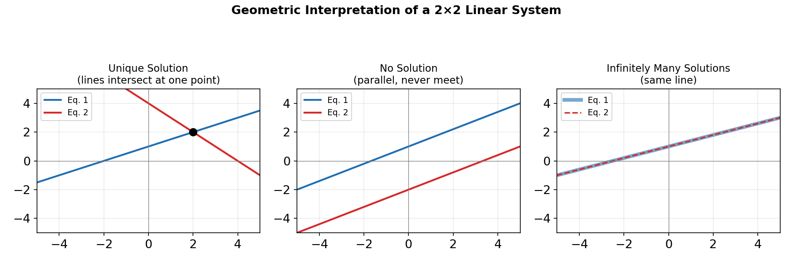

# Chapter 7: System of Linear Equations

## Representing a System with Matrices

A system of linear equations, such as:

2x + y − z = 3
x − y + 2z = 1
3x + 2y + z = 8

can be written in matrix form as AX = B, where A is the matrix of coefficients, X is the column vector of unknowns (x, y, z), and B is the column vector of constants on the right-hand side. Building on the matrix inverse and determinant methods from Chapter 6, three standard techniques solve such systems.

## Method 1: The Inverse Matrix Technique

If A is non-singular (det(A) ≠ 0), the system AX = B has the unique solution:

X = A⁻¹B

This means: find A⁻¹ (by elementary row operations or the adjoint method), then multiply it by B to get the values of the unknowns directly.

## Method 2: Gauss-Jordan Elimination

This method row-reduces the **augmented matrix** [A | B] directly to reduced row-echelon form [I | X], using the same elementary row operations as in Chapter 6:

1. Write the augmented matrix [A | B].
2. Use row operations to turn the left block into the identity matrix.
3. The right-hand column is then the solution vector X.

This is often more efficient than finding a full inverse, since it solves the system in one pass without computing A⁻¹ explicitly.

## Method 3: Cramer's Rule

Cramer's Rule expresses each unknown as a ratio of determinants. For a system with coefficient matrix A and constants B, let Aᵢ be the matrix formed by replacing the i-th column of A with B. Then:

xᵢ = det(Aᵢ) / det(A),  provided det(A) ≠ 0

Example: for 2x + y = 5 and x − y = 1, A = [[2, 1], [1, −1]], so det(A) = −2 − 1 = −3.

- A₁ (replace column 1 with B) = [[5, 1], [1, −1]], det(A₁) = −5 − 1 = −6, so x = −6 / −3 = 2
- A₂ (replace column 2 with B) = [[2, 5], [1, 1]], det(A₂) = 2 − 5 = −3, so y = −3 / −3 = 1

## Classifying Solutions: Unique, None, or Infinite

Just as in the 2×2 case seen in earlier algebra, a linear system can have exactly one solution, no solution, or infinitely many solutions — this now extends naturally to three or more variables. Row-reducing the augmented matrix reveals which case applies:

| Case | What the row-reduced matrix looks like | Geometric meaning (for 2 or 3 variables) |
|---|---|---|
| **Unique solution** | reduces cleanly to [I \| X]; det(A) ≠ 0 | lines/planes meet at exactly one point |
| **No solution** | a row reduces to 0 = k for some nonzero constant k (a contradiction) | lines/planes are parallel and never meet |
| **Infinitely many solutions** | a row reduces to 0 = 0 (always true), leaving a free variable | lines/planes coincide, or intersect along a whole line/plane |

Example: classify the system x − 2y + z = 2, 2x − y − z = 1 (only two equations for three unknowns — automatically either no solution or infinitely many, since it cannot reduce to a unique point). Row-reducing this system does not produce a contradiction, so it has **infinitely many solutions**, with one variable free to take any value and the other two expressed in terms of it.
