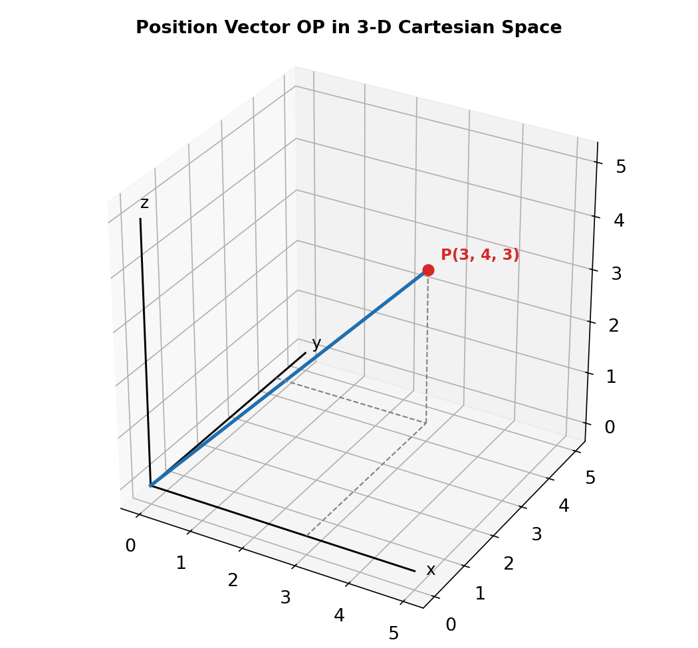
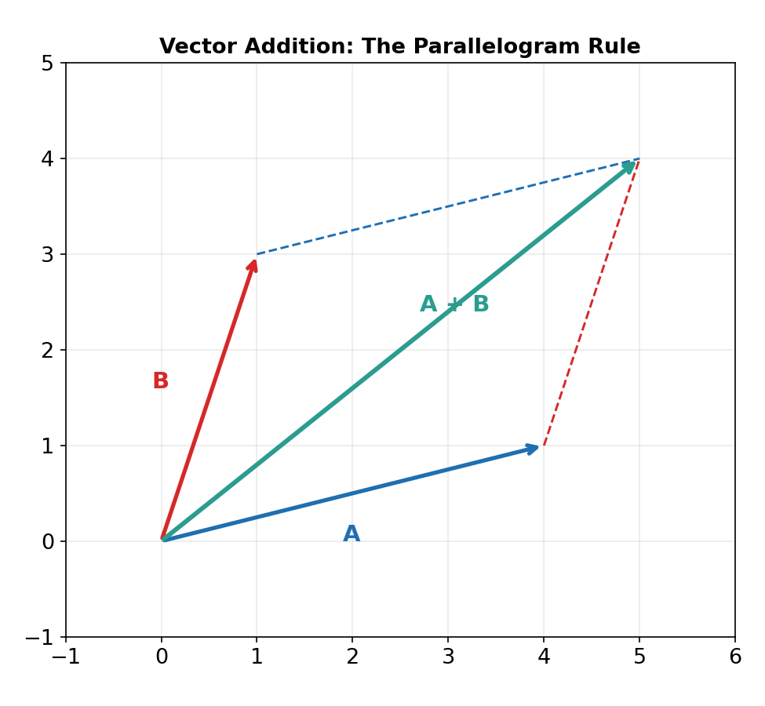

# Chapter 8: Vectors

## Cartesian Space and Coordinates

Three-dimensional space is described using a rectangular coordinate system with three mutually perpendicular axes (x, y, z) meeting at the origin O. Any point P is located by an ordered triple P(x, y, z).

The distance between two points P(x, y, z) and Q(a, b, c) in space is:

d(P, Q) = √[(x−a)² + (y−b)² + (z−c)²]

## Vectors: Basics

A **scalar** has only magnitude (e.g. mass, speed). A **vector** has both magnitude and direction (e.g. velocity, force), and is represented as a directed line segment, or in component form using the unit vectors **i**, **j**, **k** along the x, y, z axes: v = x**i** + y**j** + z**k**.

**Key vector types:**
- **Zero vector (0):** magnitude zero, direction undefined.
- **Equal vectors:** same magnitude and direction.
- **Negative vector (−v):** same magnitude as v, opposite direction.
- **Unit vector:** magnitude 1; the unit vector in the direction of v is v̂ = v / ‖v‖.
- **Parallel vectors:** point in the same or exactly opposite direction.

## Vector Operations

Vectors add according to the **parallelogram rule**: place them tail-to-tail, and their sum is the diagonal of the parallelogram they form (equivalently, place them tip-to-tail and the sum runs from the first tail to the last tip).

For vectors given in component form, OP₁ = x₁**i** + y₁**j** + z₁**k** and OP₂ = x₂**i** + y₂**j** + z₂**k**:

- **Addition:** OP₁ + OP₂ = (x₁+x₂)**i** + (y₁+y₂)**j** + (z₁+z₂)**k**
- **Scalar multiplication:** m·OP₁ = (mx₁)**i** + (my₁)**j** + (mz₁)**k**
- **Vector between two points:** P₂P₁ = OP₁ − OP₂ = (x₁−x₂)**i** + (y₁−y₂)**j** + (z₁−z₂)**k**

## The Dot (Scalar) Product

The dot product of two vectors u and v is the **scalar**:

u · v = ‖u‖‖v‖cos θ = a₁b₁ + a₂b₂ + a₃b₃  (using components u = a₁**i**+a₂**j**+a₃**k**, v = b₁**i**+b₂**j**+b₃**k**)

This gives a way to find the **angle between two vectors**: cos θ = (u · v) / (‖u‖‖v‖).

**Orthogonal (perpendicular) vectors:** u and v are orthogonal if and only if u · v = 0.

## The Cross (Vector) Product

The cross product of two vectors u and v is a **vector** perpendicular to both, found using the determinant:

u × v = | **i** **j** **k**; a₁ a₂ a₃; b₁ b₂ b₃ | = (a₂b₃ − a₃b₂)**i** − (a₁b₃ − a₃b₁)**j** + (a₁b₂ − a₂b₁)**k**

Its direction is given by the **right-hand rule** (fingers point along u, curl toward v, thumb points along u × v), and its magnitude equals the area of the parallelogram formed by u and v:

‖u × v‖ = ‖u‖‖v‖sin θ = Area of parallelogram with sides u and v

The area of a triangle with two sides u and v is therefore ½‖u × v‖.

## Triple Scalar Product

For three vectors u, v, w, the **triple scalar product** V = (u × v) · w gives the **volume of the parallelepiped** (a 3-D "slanted box") formed by the three vectors as edges:

V = |(u × v) · w|

If V = 0, the three vectors are coplanar (lie in the same plane).

## Applications: Equations of Lines in Space

A line through a point A(p, q, r) in the direction of vector v = ⟨a, b, c⟩ can be written three equivalent ways:

- **Vector form:** r = (p**i**+q**j**+r**k**) + λ(a**i**+b**j**+c**k**)
- **Parametric form:** x = p + λa,  y = q + λb,  z = r + λc
- **Cartesian (symmetric) form:** (x−p)/a = (y−q)/b = (z−r)/c

**Angle between two lines** L₁ and L₂, with direction vectors v₁ and v₂: θ = cos⁻¹[(v₁·v₂)/(‖v₁‖‖v₂‖)]. Lines are parallel if v₁ = αv₂ for some scalar α, and perpendicular if v₁ · v₂ = 0.

**Intersection of two lines:** set the parametric equations of L₁ and L₂ equal, solve for the two parameters using two of the three coordinate equations, then check the solution satisfies the third equation. If it does, the lines meet at a single point; if not, the lines are **skew** (they don't intersect and aren't parallel).

## Applications: Equations of Planes

A plane can be defined by a point on it and a **normal vector n** (a vector perpendicular to the entire plane). If A(a, b, c) is a point on the plane and n = A**i** + B**j** + C**k**, the equation of the plane is:

Ax + By + Cz = D,  where D = Aa + Bb + Cc

**Finding the normal from three points:** if P, Q, R lie on a plane, the normal is n = PQ × PR (the cross product of two vectors lying in the plane).

**Angle between two planes**, with normals n₁ and n₂: θ = cos⁻¹[(n₁·n₂)/(‖n₁‖‖n₂‖)]. Two planes are perpendicular if their normal vectors are orthogonal (n₁ · n₂ = 0).
